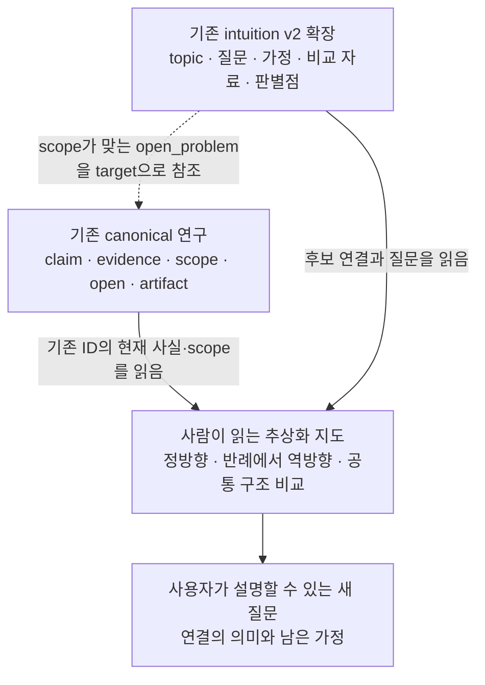
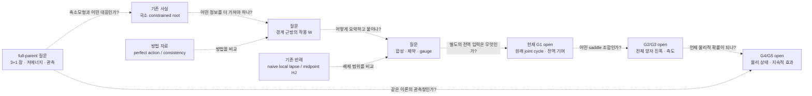

# 기존 연구 위에 얹는 추상화·직관 연결층 — 구현 전 계획

2026-09-06. 상태: **DESIGN_ONLY / NON_AUTHORITATIVE_HYPOTHESIS_GENERATION**.
검토 기준 commit: `7fc56307a8ce808348625a8bed2f6860e9717c1c`.
사용자 요청: 계산 증명을 더 진행하기 전에, 표준 그래프 엔지니어링으로 기존 연구의
연결성을 강화하여 과학적 직관을 키우는 계획을 먼저 만든다.

**권고:** 기존 `research/intuition` v2에 작은 질문 묶음과 읽기 지도를 얹는다.
첫 구현은 새 topic 3개, 질문 signal 6개, 실제 의미가 맞는 topic link 4개 이내,
그리고 세 가지 읽기 경로로 한정한다. 기존 G1–G5와 계산 결과는 원래 ID로 참조한다.
새 schema, 그래프 DB, 추론 엔진 또는 수치 runner는 이 첫 구현에 필요하지 않다.

이번 문서는 계획과 연결 예시다. 아래 추가 ID와 문서 경로는 제안이며 아직 생성·등록하지
않았다. 구현 순서는 데이터·읽기 경험을 완성하는 순서이고, 물리 계산 실행 순서가 아니다.

## 1. 사용자가 얻어야 할 경험

한 결과를 열었을 때 다음 질문에 한 화면 또는 짧은 읽기 경로로 답할 수 있게 한다.

- 이 결과가 보여 주는 가장 단순한 구조는 무엇인가?
- 이것을 어떤 더 큰 대상으로 요약해 볼 수 있는가?
- 두 대상 사이에서 무엇이 보존되어야 하는가? 아직 무엇을 모르는가?
- 비슷해 보이지만 다른 사례, 실패한 지름길, 경쟁 설명은 무엇인가?
- 이 연결이 살아남으면 어떤 후속 질문을 더 명확히 말할 수 있는가?

직관 향상은 edge 수나 중앙성 점수로 평가하지 않는다. 기존 결과를 재발견하는 시간을 줄이고,
전에는 섞어 말했던 대상을 구별하며, 새로운 판별 질문을 설명할 수 있는지가 목표다.
아이디어 단계에는 여러 후보를 함께 남긴다. signal의 판별·중단 문구는 생각의 경계를
설명하기 위한 것이며, 지금 계산하거나 모두 입증해야 하는 과제가 아니다.

## 2. 확인한 기존 기반과 실제 빈칸

아래 수치는 이 계획을 위한 조회 시점의 snapshot이다. live 정본은 각 CLI 출력이다.

| 기반 | 확인한 상태 | 재사용 방식 |
|---|---|---|
| Native canonical graph | strict JSON, 의미 검사, artifact hash, 실제 typed edge | claim/evidence/open/scope를 그대로 참조 |
| Intuition v2 | topic 3, topic link 2, source 20, candidate signal 10; validation 성공 | 새 질문·개념 연결의 작성 위치 |
| 현재 refined source 질문 | `open:gate1-starobinsky-exact-gauge-preserving-element-source` 검색 signal **0개** | 이번에 우선 메울 빈칸 |
| 현재 G1 global-cycle 질문 | 해당 target 검색 signal 2개 | census/미해결 값 구별 렌즈를 재사용 |
| Sidecar registry | 고정 경로·schema·SHA 검사 | v2 변경 시 해당 entry hash를 함께 갱신 |
| External KG bridge audit | 별도 외부 식별자 매칭 감사 | 개념 사이의 직관적 연결과 용어를 구별 |
| Graph-aware harness | `470/470` hashes, 오류 0, 기존 경고 75 | 기존 사실의 locator와 출처를 신뢰할 기준 |

코드상 `intuition search`는 **topic 또는 canonical target의 정확한 일치**로 signal을
고르고 file order로 최대 20개를 반환한다. 자유 텍스트는 canonical context만 순위화한다.
현재 signal 0개를 semantic search 실패나 해당 아이디어의 부재로 해석하지 않는다.

참조 구현:
[intuition model](../../src/intuition/model.ts),
[조회](../../src/intuition/commands.ts),
[의미 검사](../../src/intuition/core.ts),
[registry](../../research/sidecars/collection.v1.json),
[기존 직관 지도](../../research/intuition/ICE_GEOMETRY_CPT_SUSY_INTUITION_MAP_2026-09-03.md).

## 3. 세 층의 역할



- **사실층:** canonical graph가 계속 유일한 연구 판정 정본이다. 기존 결과를 새 claim으로
  복제하지 않는다. 원문 narrative는 아이디어의 맥락으로 보존한다.
- **직관층:** 기존 topic/signal을 확장한다. 관련 문헌, 가정, 비유의 범위와 경쟁 설명을
  엮는다. 아직 근거가 덜 갖춰진 아이디어는 topic의 질문이나 사람 지도에 남길 수 있다.
- **읽기층:** 여러 추상화 수준을 한눈에 배치한다. 세로 위치와 화살표는 읽기 순서를
  표현할 수 있지만, 그 자체로 논리적 의존성이나 입증된 derivation을 만들지 않는다.

현재 v2의 `canonical_target`은 범위가 맞는 CPT `open_problem`만 허용한다. 기존 결과
claim/evidence는 사람 지도에서 원래 ID와 보고서로 읽거나 canonical context에서 조회한다.
이를 편하게 보이게 하려고 sidecar target의 타입을 바꾸지 않는다.

## 4. 관계를 어떻게 읽게 할 것인가

다음 다섯 표지는 **사람 지도에서 사용하는 설명용 표지**다. 전부를 새로운 machine predicate로
추가한다는 뜻이 아니다. 글자·선 모양을 함께 사용하여 색만으로 상태를 전달하지 않는다.

| 표지 | 사용자가 읽을 의미 | 저장 위치 |
|---|---|---|
| 기존 사실 | 이 범위에서 이런 결과가 기록돼 있다 | 기존 canonical ID·보고서 링크 |
| 조건부 연결 | 이 입력과 관계가 갖춰지면 저 대상을 구성할 후보가 된다 | signal의 assumptions/lens/판별점 + 설명 |
| 방법 비유 | 이 논문·다른 모델은 같은 종류의 문제를 다루는 방법을 준다 | source_refs와 role/boundary |
| 범위가 있는 반례 | 이 특정 연결·가정은 기존 결과에서 실패했다 | 원래 evidence와 scope를 함께 링크 |
| 구별 | 서로 대체할 수 없는 대상이다 | 의미가 맞으면 기존 `DISTINCT_FROM` |

v2 machine topic link는 기존 두 종류만 쓴다.
`DISTINCT_FROM`은 구별을 뜻하며 서로 아무 관계가 없다는 선언이 아니다.
`MAY_SHARE_UNRESOLVED_ACTION_WITH`은 공통 작용을 가질 수 있다는 질문이며, source가 같다는
확정이나 dependency가 아니다. 이 두 relation으로 표현할 수 없는 화살표는 설명용 주석에
남긴다. `MAY_SHARE_UNRESOLVED_ACTION_WITH`을 모든 미래 연결의 대용품으로 쓰지 않는다.

## 5. 첫 구현에 넣을 구체적인 내용

### Topic 세 개

| 제안 ID | 핵심 질문 | 기존 지도와의 접점 |
|---|---|---|
| `topic:local-continuum-branch-to-source-structure` | 한 연속 해를 어떤 경계 동역학 대상으로 요약할 수 있는가? | 새 certificate, refined source open, 기존 G1 topic |
| `topic:boundary-amplitude-and-physical-state` | 고전 작용·양자 진폭·물리 상태는 어떤 정보를 서로 넘겨야 하는가? | G2/G3 opens, 기존 CPT/SUSY topic의 G4/G5 signals |
| `topic:reduced-model-versus-full-theory` | 축소모형에서 보이는 구조를 전체 장 이론과 연결하려면 무엇이 필요한가? | full-theory 완료 조건과 기존 geometry topic을 비교해서 읽음 |

세 번째 topic은 일반 full-parent 질문이다. 기존 V=0 HDA 또는 empirical open을
Starobinsky/전체 TOE의 정본 target으로 재사용하지 않는다. 범위가 정확히 맞는 open이 없으면
`canonical_target`을 생략한다. 새 canonical open은 이 계획 때문에 만들지 않는다.

### Signal 여섯 개

| 제안 ID | 생각을 연결하는 질문 | topic / target |
|---|---|---|
| `intuition:continuum-root-to-boundary-action` | 한 점의 해 인증과 경계조건 근방의 작용 함수는 무엇이 다른가? | 첫 topic / refined source open |
| `intuition:boundary-composition-and-gauge` | 구간을 나누어 붙여도 같아야 하는 것은 무엇이며, lapse와 gauge는 어디에 남는가? | 첫 topic / refined source open |
| `intuition:midpoint-counterexample-to-source-alternatives` | 기존 midpoint/HJ/local-lapse 실패가 어떤 후보를 배제하고 무엇은 남기는가? | 첫 topic / refined source open |
| `intuition:global-selection-to-uniform-amplitude` | 선택된 전역 계수가 있다는 조건에서, fold 표현에 넘겨야 할 위상·정규화·오차 정보는 무엇인가? | 둘째 topic / `open:gate2-hard-cfu-airy-coefficients` |
| `intuition:classical-action-versus-quantum-measure` | 작용의 합성에 더해 전체 양자 진폭에는 어떤 정보가 필요한가? | 둘째 topic / `open:gate3-full-bfv-pfaffian-pin-holonomy` |
| `intuition:reduced-solution-to-parent-scope` | 같은 축소 방정식을 공유하는 다른 parent 후보를 무엇으로 구별할 수 있는가? | 셋째 topic / canonical target 없음 |

G1 census 두 signal, G4의 CPT/Pin 대 physical Q signal, G5의 state 대 pole-splitting
signal, geometry의 관측 상관 signal은 **기존 ID를 재사용**한다. 새 signal에 같은 내용을
복제하지 않는다. 신규 문헌은 최대 네 개를 우선 검토한다: CAPD, BDS perfect action,
Dittrich–Höhn constraint analysis, Dittrich cylindrical consistency. v2 source record에
원문 URL·version·조회일·pinpoint·사용 범위를 채우고, canonical source mirror는 URI와
대응 노드가 정확히 같을 때만 기록한다.

Topic link 제안은 다음 네 개 이내다. 구현 시 각 rationale을 읽고 실제 의미가 맞는 것만 남긴다.

1. 첫 topic `DISTINCT_FROM` 기존 `topic:gate1-cycle-and-orientation-methods`:
   국소 source 구성과 전역 경로 선택의 차이.
2. 첫 topic `MAY_SHARE_UNRESOLVED_ACTION_WITH` 둘째 topic:
   명시된 공통 variational action이 있을 경우 두 경계 기술을 함께 유도할 수 있는가라는
   질문. 공통 action의 명칭·field/domain 대응이 없으면 연결은 미해결로 남긴다.
3. 둘째 topic `DISTINCT_FROM` 기존 `topic:cpt-folded-susy-synthesis`:
   amplitude의 정의와 물리적 charge/state/spectrum의 성립을 구별.
4. 셋째 topic `DISTINCT_FROM` 첫 topic:
   축소모형의 국소 해와 full-parent의 장·대칭·자유도 질문을 구별.

이 수량은 구현 범위의 상한/초안이며 성공 metric이 아니다. 연결 이유가 약한 항목은 줄인다.

## 6. 실제 읽기 지도 초안

아래 점선은 모두 **검토할 연결 질문**이다. 화살표의 존재로 입증이나 자동 후속 작업을
표시하지 않는다. 특히 source-defined original cycle은 국소 작용만으로 따라오지 않는다.



이 지도는 아래 세 가지 경로로 읽게 한다.

**경로 A — 한 결과에서 추상화하기.** 이번 certificate → 경계 데이터가 바뀌는 문제 →
작용 W → 합성할 때 보존할 정보 → 별도로 필요한 global cycle. 사용자는 각 전환에서
무엇을 요약했고 무엇이 추가 입력인지 설명할 수 있어야 한다.

**경로 B — 반례에서 아이디어를 고치기.** 기존 midpoint/HJ 또는 local-lapse 실패 →
실패한 가정 → exact-continuum, constrained action, extended gauge라는 서로 다른 후보.
새 후보가 성공했다고 쓰지 않고, 반례가 아이디어 공간을 어떻게 나누는지 보여 준다.

**경로 C — 서로 먼 연구를 비교하기.** geometry의 공통 작용 질문 ↔ CPT/Pin과 Q의 구별 ↔
state와 spectrum의 구별 ↔ 두 관측 영역의 상관 질문. 연결 근거는 비교할 구조와 필요한
공통 입력이다. 다른 canonical graph의 결과는 원래 scope를 가진 비교 자료로 읽는다.

각 전환의 설명은 같은 작은 카드 형식을 쓴다: **출발 사실/질문 → 요약할 대상 → 보존할
관계 → 추가 가정 → 가까운 반례·대안 → 원문·기존 ID**. 이것은 사람 지도의 편집 형식이며
별도 ledger나 schema가 아니다. 카드는 정확한 v2 signal ID/source_refs와 canonical ID를
가리킨다. mutable signal 필드나 현재 판정을 별도 정본처럼 복제하지 않는다.

첫 지도의 실제 앵커는 다음과 같다. claim의 지위는 각 원래 scope에서 읽는다.

| 연결 지점 | 기존 앵커와 읽을 자료 |
|---|---|
| 국소 해 | `evidence:gate1-starobinsky-continuum-constrained-endpoint-certificate`; [인증 보고서](ICE_STAROBINSKY_CONTINUUM_ENDPOINT_CERTIFICATE_2026-09-06.md) |
| 첫 missing source | `open:gate1-starobinsky-exact-gauge-preserving-element-source`; [native CPT graph](../../ontology/cpt-temporal-folded-susy/graph.json) |
| local-lapse 반례 | `evidence:gate1-m2-starobinsky-naive-local-lapse-gauge-test`; [해당 범위의 감사](../../cpt_temporal_folded_susy/GATE1_M2_STAROBINSKY_NAIVE_LOCAL_LAPSE_GAUGE_TEST.md) |
| midpoint/HJ 반례 | `evidence:gate1-m2-starobinsky-midpoint-hj-identity-audit`; [해당 범위의 감사](../../cpt_temporal_folded_susy/GATE1_M2_STAROBINSKY_MIDPOINT_HJ_IDENTITY_AUDIT.md) |
| G1–G5와 full-parent 경계 | [현재 TOE 의존 경로](../decisions/ICE_TOE_CRITICAL_PATH_ROUTING_2026-09-01.md) |
| CPT/Pin, Q, state, spectrum 비교 | [기존 geometry–CPT–SUSY 지도](../../research/intuition/ICE_GEOMETRY_CPT_SUSY_INTUITION_MAP_2026-09-03.md) |

## 7. 표준 그래프 엔지니어링 적용

| 표준·기존 장치 | 이번 계획에서 적용하는 원칙 | 첫 구현의 범위 |
|---|---|---|
| Native strict schema + graph-qualified ID | 같은 연구 대상을 다른 이름으로 복제하지 않음 | v2 existing schema와 ID 참조 재사용 |
| [RDF 1.1](https://www.w3.org/TR/rdf11-concepts/) | graph/dataset과 statement의 의미를 구별 | 기존 canonical named-graph 경계 유지 |
| [JSON-LD 1.1](https://www.w3.org/TR/json-ld11/) | 명시적 context와 IRI로 교환 | 기존 one-way canonical export 유지 |
| [PROV-O](https://www.w3.org/TR/prov-o/) | 출처/생성 경로와 과학적 지지를 구별 | source record·Git·SHA를 유지; 새 PROV runtime 없음 |
| [SHACL 1.0](https://www.w3.org/TR/shacl/) | 구조 적합성과 주장 진실성을 구별 | 기존 canonical export shape 검사 재사용 |
| Native relation review | 실제 relation의 의미와 방향을 확인 | v2의 두 relation만 사용 |
| Fixed competency questions | 사용자가 기대한 질문에 접근할 수 있는지 확인 | 아래 8개 의미 점검 |

현재 sidecar는 canonical RDF/JSON-LD/SHACL/SPARQL corpus에 포함되지 않는다.
첫 구현도 이를 바꾸지 않으며 **intuition v2는 JSON Schema + semantic validator로 검증**한다.
표준을 재사용한다는 이유로 sidecar 자체가 이미 SHACL 적합하다고 쓰지 않는다.

추후 machine-readable analogy/conditional-handoff 조회가 실제 필요해지면, 그때만 별도
버전의 relation record를 설계한다. record에는 대응 대상, 비교 차원, 추가 전제, 차이/범위,
출처, 상태를 담고 현재 canonical export와 분리해야 한다. 이는 첫 구현의 완료 조건이 아니다.
`owl:sameAs`, 동치 선언, transitive support, PROV 출처를 통한 과학적 인과 추론은 사용하지 않는다.
SKOS도 현재 필요하지 않다. 도입한다면 taxonomy/related 개념 연결에만 한정하며 연구 가설의
동치·증거 연결로 매핑하지 않는다.

## 8. 구현 단위와 변경 파일

첫 구현은 하나의 coherent content 변경으로 검증·commit한다.

| 순서 | 작업 | 산출물·완료 조건 |
|---|---|---|
| A | 기존 결과·반례·open·방법 자료의 역할을 대조 | 위 여섯 질문의 source와 정확한 target 확정; 과장된 연결 제거 |
| B | v2 content 확장 | topic 3개·signal 6개·link 최대 4개, 필요 source 최대 4개; 기존 ID 보존 |
| C | 추상화 읽기 지도 작성 | 경로 A/B/C와 카드; 모든 기존 사실은 정본 링크로 접근 |
| D | 실제 조회·무결성·의미 검토 | 아래 acceptance 충족 후 관련 파일을 함께 local commit |

예상 변경 경로:

- `research/intuition/scientific-intuition-signals.v2.json`
- `research/sidecars/collection.v1.json` — v2 entry의 실제 새 document hash
- `research/intuition/ICE_ABSTRACTION_CONNECTIVITY_MAP_2026-09-06.md` — 제안된 새 읽기 지도
- `research/intuition/README.md` — 기존 검색 명령과 새 진입점
- `research/intuition/ICE_GEOMETRY_CPT_SUSY_INTUITION_MAP_2026-09-03.md` — 새 지도에 대한 짧은 연결

`scientific-intuition-signals.v1.json`은 frozen hash-pinned provenance로 유지한다.
`ontology/collection.json`, canonical graph의 claim/status/evidence, 외부 KG audit,
Python 계산 결과와 repro manifest는 이 content 구현의 변경 대상이 아니다.
Graph infrastructure 완료 기준을 재개하거나 새로운 graph release profile을 만들지 않는다.

## 9. Acceptance: 연결이 실제로 직관을 돕는가

| 점검 질문 | 기대하는 답의 연결 | 실패로 볼 혼동 |
|---|---|---|
| Q1. 이번 root 다음에 무엇을 생각해야 하나? | refined-source target의 새 질문 3개, 기존 certificate·source open | root만으로 W/gauge/G1이 완성됐다고 읽힘 |
| Q2. 구간 둘을 붙인다는 것은 무엇인가? | W, interface, lapse/gauge의 서로 다른 역할 | 그저 같은 trajectory를 두 번 그리는 것으로 대체 |
| Q3. midpoint 반례가 무엇을 막았나? | 기존 두 evidence와 각 scope, 남은 대안 | 모든 continuum/perfect-action 경로의 반증으로 확대 |
| Q4. 해의 존재와 해의 기여는 무엇이 다른가? | 기존 G1 signal 두 개와 새 G2 질문 | local saddle를 자동 nonzero global coefficient로 취급 |
| Q5. 작용·측도·상태는 어떻게 이어지나? | 새 G3 질문과 기존 G4/G5 signals | 고전 합성이나 bosonic determinant만으로 물리 상태 주장 |
| Q6. 전체 TOE와 현재 축소모형의 간격은? | parent topic, 기존 full-theory 조건 | V=0/P-lane를 Starobinsky/전체 이론의 근거로 합침 |
| Q7. geometry와 CPT/SUSY를 왜 함께 보나? | 기존 두 topic의 구별과 unresolved common-action 질문 | 같은 말·숫자·문헌을 물리적 동일성으로 취급 |
| Q8. 없는 연결은 어떻게 표시되나? | 빈 결과·UNRESOLVED·target 없음이 그대로 보임 | 빈칸을 zero/false 또는 새 canonical ID로 채움 |

완료 판정은 Q1–Q8을 실제 자료와 조회에서 설명할 수 있는지다. 이는 질문별 독해 점검이며
LLM reasoning 정확도나 발견 확률을 수치화한 benchmark가 아니다.

구현 후 실행할 기존 명령:

```bash
./ice intuition validate --json
./ice intuition search "local branch to boundary action" --target intuition::topic:local-continuum-branch-to-source-structure --json
./ice intuition search "boundary action composition gauge" --target cpt::open:gate1-starobinsky-exact-gauge-preserving-element-source --json
./ice intuition search "full parent scope" --target intuition::topic:reduced-model-versus-full-theory --json
./ice sidecars validate --json
./ice bridges validate --json
./ice ontology review --graph all --base HEAD
./ice graphrag diff --base HEAD --limit 12 --json
npm run graph:check
git diff --check
```

source target에 의도한 세 질문이 반환되고 topic-only query의 `canonical_context`는 null이어야
한다. canonical diff는 0이어야 하며, 기존 retrieval/routing 경계가 변하지 않아야 한다.
최종 `graph:check`는 등록된 active sidecar와 registry hash 변경을 통합 검증한다.
이 명령 안에서 GraphRAG eval과 agent eval도 review 이후 실행되므로 따로 반복하지 않는다.
`bridges validate`는 외부 KG 경계의 회귀 확인이며 직관 관계의 검증이 아니다.
데이터만 바꾸는 첫 구현에는 새 test 파일이 필요하지 않다. 실제 코드/schema 변경이 필요해진
경우에만 변경 이유를 재검토하고 그 동작을 확인하는 의미 있는 경계 테스트를 추가한다.
수치 계산을 content 변경의 형식 요건으로 만들지 않는다.

## 10. 이번 계획에서 수행한 확인

- `./ice intuition validate --json` 통과; source/cycle 두 exact-target query에서 각각 0/2
  signal을 관측했다. `./ice harness check`의 470/470 hash와 기존 경고를 확인했다.
- `./ice sidecars validate --json`와 `./ice bridges validate --json`도 통과했다.
  후자는 기존 unresolved 75건의 외부 식별자 경계를 확인한 것이며 연결을 해결한 결과가 아니다.
- intuition model/조회/의미 검사, sidecar registry, external KG audit의 분리와
  [표준 그래프 정책](../decisions/ICE_STANDARD_GRAPH_ENGINEERING_2026-09-01.md),
  [완료 profile](../decisions/ICE_REPOSITORY_LOCAL_GRAPH_COMPLETION_PROFILE_2026-09-02.md),
  [직관 계층 정책](../decisions/ICE_SCIENTIFIC_INTUITION_SIGNAL_LAYER_2026-09-02.md)을 읽었다.
- 표준의 1차 문서는 위 W3C 링크에서 확인했다. 구현 구조, 연결의 과학적 의미, 표준의
  적용 범위를 별도 read-only 검토로 대조했다.
- 계획의 기존 local link와 canonical anchor가 실제 존재함을 확인했고, `git diff --check`를
  수행했다. active v2/registry/schema/runtime을 바꾸지 않은 계획 문서 작업이므로
  미래 구현용 `npm run graph:check`는 이번 계획 작성에서 실행하지 않았다.
- 이번 산출물은 이 계획과 README의 진입 링크다. 위 B–D 구현과 계산 증명은 수행하지 않았다.

## 11. 구현 완료 기록 — 2026-09-06 후속 작업

위 10절은 계획 작성 시점의 기록이다. 이후 사용자 요청에 따라 A–D를 구현했다.
[추상화 연결 지도](../../research/intuition/ICE_ABSTRACTION_CONNECTIVITY_MAP_2026-09-06.md)와
active v2가 현재 진입점이다. 새 topic 3개, signal 6개, topic link 4개, primary method
source 4개를 추가했고 기존 v2의 모든 객체와 frozen v1 bytes를 보존했다.
registry에는 실제 v2 SHA-256
`cbfcc8c3839b12658092ff60f667fe2c07627cec87b776a13007b9594f27d8a2`만 갱신했다.

Q1–Q8은 지도·source·exact-target 조회를 대조해 확인했다. source target은 새 질문 3개,
local/amplitude/parent topic은 각각 3/2/1개, 기존 G1 target은 기존 질문 2개를 반환했다.
topic-only query의 canonical target/context는 모두 null이었다. 기존 G4/G5 lens는 유지했고,
parent scope와 geometry를 별도 evidence로 합치지 않았다. 독립 read-only 검토에서도
target 오류나 scope 확대는 발견하지 못했다.

실행한 검증은 9절 명령들이다. `ontology review`는 네 graph와 collection 변경 0건,
`graphrag diff`는 15개 case의 순위·통과·abstention·boundary 변경 0건이었다.
첫 `npm run graph:check`는 기존 live-content test에 고정된 예전 3/2/20/10/10 count 때문에
162개 중 1개가 실패했다. `test/intuition-signals.test.ts`의 그 기대값만 현재
6/6/24/16/16으로 갱신했고, 두 번째 전체 실행은 strict typecheck, 162개 test,
ontology/family/sidecar/bridge/SHACL 검사와 GraphRAG/competency/agent 평가까지 exit 0이었다.
새 test나 runtime/schema 변경은 없었다. local link와 `git diff --check`도 통과했다.

이 완료는 직관을 위한 내용·조회 연결의 완료다. 새 계산 결과, 원래 적분 cycle, global
intersection, 물리 발견 또는 TOE 지위를 추가하지 않았다.
