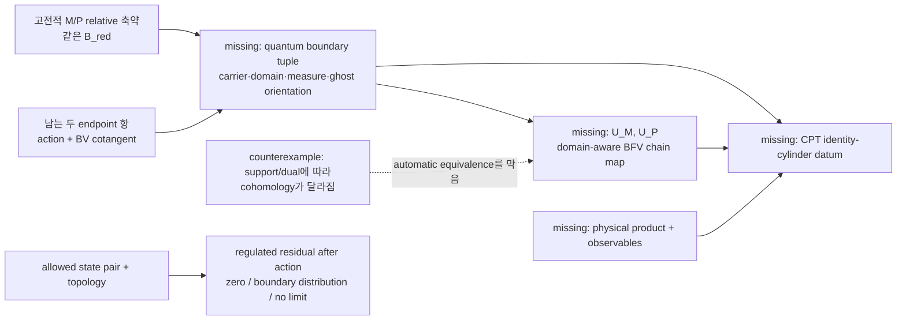

# HSWM 상태로 읽는 primary 경계축약: 무엇이 다음을 결정하는가

2026-09-08 · `SUPPORTING_METHOD` · 연구 상태 지도. 새 양자 연산자, 물리 상태, CPT 접합 또는 G1 진전을 주장하지 않는다.

이 메모의 실행 가능한 상태는 [primary-boundary-state.v1.json](../../research/hswm/primary-boundary-state.v1.json)이다. HSWM이 이 상태를 읽을 때의 핵심은 “다음 계산을 많이 만들기”가 아니다. 지금 무엇이 **이미 같은 대상에 대한 결과인지**, 무엇이 **다른 carrier에서 나온 반례인지**, 그리고 어떤 객체가 생겨야 두 결과를 비교할 수 있는지를 한 관계로 보이게 하는 데 있다.

## 한 눈에 보는 연구 구조

고전적 결과는 명확하다. 두 선택

\[
M:\Pi=\bar c=0,\qquad P(N_0):N=N_0,\rho=0
\]

은 선언한 chart에서 각자의 허용 변분과 (Q)-접선성을 만족하고 같은

\[
(\mathcal B_{\rm red},\alpha_{\rm red},\Omega_{\rm red}),
\qquad \Omega_{\rm red}=cH_L
\]

로 내려간다. 그러나 source에서 bulk primary doublet을 정리해도 action의
\(-[\sigma^+\rho]\)와 BV-cotangent의 \([\sigma^+\delta N]\)는 남는다. 그러므로 “같은 고전적 몫”은 **같은 양자 상태공간**이라는 문장이 아니다. 이 둘은 다른 종류의 객체다. [고전적 축약 보고서](../../cpt_temporal_folded_susy/STAROBINSKY_RELATIVE_PRIMARY_BOUNDARY.md), [source-induced interval 자료](ICE_STAROBINSKY_SOURCE_INDUCED_INTERVAL_BVBFV_2026-09-07.md).

## HSWM이 떠먹여야 할 세 가지 구별

### 1. 고전적 quotient map은 양자 comparison map이 아니다

고전적 \(r_M,r_P\)는 각각 선택한 coisotropic slice에서 특성 방향을 몫내어
\(\mathcal B_{\rm red}\)로 보내는 **classical quotient map**이다. 이 말은 중요하다.
두 map이 실제로 같은 classical reduced data를 준다는 것이 이미 확인됐기 때문이다.
하지만 이 map들은 아직 Hilbert/test carrier, operator domain, measure 또는 quantum
BFV differential 사이에서 작용하는 map이 아니다.

양자에서 필요한 것은 각 \(X=M,P\)마다 다음을 한 덩어리로 선언한
**quantum boundary tuple**이다.

\[
(D_X^\bullet,\widehat\Omega_X;D_{\rm red}^\bullet,
\widehat\Omega_{\rm red};\text{polarization, measure/half-density,
ghost orientation, residual/gauge data}).
\]

그 다음에야 \(r_X\)를 양자에서 구현한다고 주장할 수 있는 비교사상 \(U_X\)의
진짜 질문을 쓸 수 있다.

\[
U_XD_X^\bullet\subseteq D_{\rm red}^\bullet,
\qquad
\widehat\Omega_{\rm red}U_X=U_X\widehat\Omega_X.
\]

직관적으로 classical quotient map은 “무엇을 gauge 방향으로 버렸는가”를 말한다.
quantum comparison map은 “어떤 상태를 어떤 위상과 내적으로 옮기며 BFV 연산이 그
이동과 교환하는가”를 말한다. 따라서 HSWM route의 첫 선택은 “seam kernel을 계산한다”가
아니라 **tuple의 빠진 칸을 드러낸다**여야 한다. 이 사상이 없으면 compact-\(N\)
contraction, source의 \(s\)-history 적분, 또는 endpoint canonical relation을 서로
대신할 수 없다.

### 2. 규제의 비영성은 상태에 작용시키기 전에는 판정이 아니다

고정 box의 (a=2) face에서는 이미 선언한 실수 compact test pair에 대해 Gaussian Ward 극한이 Green boundary form으로 계산됐다. common Dirichlet/real Robin jets에서는 0이 될 수 있고, 다른 허용 test pair에서는 비영일 수 있다. 그래서 “양의 규제 폭에서 비영 잔여항이 있다”는 사실만으로 남는 물리 항이나 anomaly를 읽을 수 없다.

판정 단위는 다음 네 항의 n-ary 묶음이다.

\[
(\text{left/right state pair},\;\text{bosonic/Berezin pairing},\;
\text{limit topology},\;\text{regulator/cutoff removal order})
\longmapsto
\{0,\;\text{nonzero boundary distribution},\;\text{no limit}\}.
\]

이것이 `regulator-removal-decision` 객체다. 다른 face, state family, 또는 box 제거를 이 fixed-box control과 같다고 부르지 않는다. [Ward face-limit 보고서](../../cpt_temporal_folded_susy/STAROBINSKY_WARD_FACE_LIMIT.md).

### 3. 상태를 넓히는 것은 상태를 보존하는 것과 다르다

현재 compact-\(N\) primary complex에서는 (H^0=H^1=0), (H^2\)는 무한 차원이다. 반면 선언한 same-degree continuous coefficient dual의 top cohomology는 0이고, degree-reversed graded dual의 detector는 별도로 남는다. 이것들은 모순이 아니라 **서로 다른 support·degree·topology를 가진 복합체**의 결과다.

따라서 “dual에 해가 있다”, “positive family가 있다”, “classical quotient가 같다” 중 어느 것도 물리 product나 CPT seam을 자동으로 선택하지 않는다. RAQ도 제약해를 찾을 test space, auxiliary representation, observable *-algebra, rigging map/physical product를 별도 입력으로 둔다. [Giulini–Marolf, §§II.1–II.2](https://arxiv.org/html/gr-qc/9812024)와 [state criterion audit](../../cpt_temporal_folded_susy/STAROBINSKY_BFV_STATE_CRITERION_AUDIT.md)의 구별을 따른다.

## 실제 CPT 접합은 마지막 호환성 검사다

CPT 접합 후보는 anti-linear sign table 하나가 아니다. 같은 domain 위에서 다음을 묶은 identity-cylinder datum이다.

1. left/right polarization과 half-density
2. 순서가 정해진 ghost Fourier/Berezin kernel
3. interval kernel과 BFV distributional intertwining
4. gluing normalization
5. positive product 및 observable adjoint와의 양립

즉 (U_M,U_P)의 domain-aware chain-map 검사를 통과한 뒤에도, product와 observable common domain을 정하고 나서야 CPT kernel을 검사한다. CPT-like covariance가 양의 Cauchy-label weight 하나를 고르지 못한다는 scoped control도 이미 있다. [graded seam adversarial review](ICE_STAROBINSKY_GRADED_SEAM_ADVERSARIAL_REVIEW_2026-09-07.md), [observable selection](../../cpt_temporal_folded_susy/STAROBINSKY_OBSERVABLE_SELECTION.md).

## 제안 검토: 교환식이 맞아도 상태를 버릴 수 있다

HSWM 회차에 **점 평가와 rho 제거** 후보를 명시적으로 검토시켰다. 이는 질문에서 제시한
후보를 전개한 것이며, HSWM이 독자적으로 발견한 사상이나 source에서 유도된 양자화가 아니다.
아래는 기존 결과를 입력으로 둔 조건부 반례 설계다.

기존 compact 시험복합체를 \(C=\Phi\otimes\Lambda(c,\rho)\),
\(\widehat\Omega_C=cH+\rho p_N\)으로 두고, **비교용으로 선언한** target은
\(E=\Psi\otimes\Lambda(c)\), \(\widehat\Omega_E=cH\)로 둔다. \(E\)의 차수는 0,1이다.
\(N_0\)를 구간 내부에 고정하고, density frame과 normal trace의 정규화를 별도로 골라

\[
 U_P(u+cx+\rho y+c\rho z)
   =u|_{N_0}+c\,x|_{N_0}
\]

를 제안한다. \(H\)가 \(N\)에 무관하고 trace가 target의 a/phi collars와 모든 \(H\)
경계 jets를 보존하여 \(\mathrm{ev}_{N_0}\Phi\subseteq\Psi\),
\(H\mathrm{ev}_{N_0}=\mathrm{ev}_{N_0}H\)가 된다는 입력 아래, 차수별로 \(\widehat\Omega_EU_P=U_P\widehat\Omega_C\)를
검사할 수 있다. 이 등식 하나로는 상태의 보존을 판정하지 못한다. 영 사상도 교환식만은 만족한다.
N collars와 \(p_N\) jets는 source \(\Phi\)의 조건이며, N 변수가 없는 target으로
그 조건을 그대로 옮긴다는 뜻은 아니다.

이를 공격하는 증인은 기존 detector 자료로 설계할 수 있다. \(t_gH=0\),
\(t_g(v)=1\)인 \(v\in\Psi\)와 \(\int\chi\,dN=1\)인 compact smooth bump를 택해

\[
 Z=c\rho\chi(N)v,\qquad
 T_g(Z)=t_g\!\left(\int\chi v\,dN\right)=1
\]

로 둔다. 기존 detector가 exact 상태를 소거한다는 입력 아래 이 상태는 비영 class를
검출하지만, 제안한 \(U_P\)는 \(\rho\) 성분을 버리므로 \(U_PZ=0\)이다. **이 소실의 직접
이유는 ghost 성분 제거다.** bump를 \(N_0\)에서 떨어뜨리면 scalar 점 평가도 전체 적분값을
놓친다는 별도의 직관이 생기지만, 이 top-class 증인에는 그 추가 선택이 필요하지 않다.

기존 \(F\)는 \(\rho\) 계수를 적분해 차수 1,2의 축소 복합체로 옮긴다. 따라서 단순히
“같은 고전적 primary 변수를 없앤다”는 말로 두 사상을 동등하게 만들 수 없다.
[실제 적분 contraction과 detector 유도](../../cpt_temporal_folded_susy/STAROBINSKY_PRIMARY_REDUCTION_DERIVATION.md)의
차수·support·사상 방향이 이 비교의 근거다. \(T_g\)는 degree-reversed dual의 차수 −2인
complex-bilinear detector이며 양의 물리 내적이 아니다.

이 후보를 검사할 때는 **전체 차수의 chain defect**와 **위 비영 증인의 pairing 손실**을
함께 본다. top cocycle 하나에서 defect가 0인지만 보면 너무 약하다. 또한 이 후보의 실패는
선택한 compact class를 보존한다는 요구와의 불일치다. Source가 모든 \(P(N_0)\) 양자화에
그 보존을 요구한다고 확인하지 않았으므로, 모든 P 축약이나 CPT 접합을 반증하지 않는다.
물리 내적, residual/gauge data, source-compatible quantization과 interval kernel은 여전히 없다.

이렇게 공동 전제와 실패 증인을 함께 표시하는 것이 이번 HSWM 입력 구조의 용도다.
교환식에서 끝나던 읽기 순서를 **carrier·차수 → 사상 → 검출되는 class → pairing**으로
연결한다. 이 검토만으로 canonical claim이나 source-derived tuple을 추가하지 않는다.

## HSWM의 현재 route와 다음 bounded 질문

상태 profile은 `domain → map → obstruction`을 각각 `quantum-boundary-tuple → quantum-comparison-map → support-sensitive-carrier-contrast`로 둔다. 따라서 현재 HSWM이 우선해야 하는 것은 새로 계산한 숫자가 아니라 다음 질문의 답이다.

> 한 개의 명시한 polarization과 half-density/Berezin convention에서, (M) 또는 (P(N_0)) 하나에 대한 (D_X^\bullet,D_{\rm red}^\bullet,\widehat\Omega_X,\widehat\Omega_{\rm red},U_X)를 모두 쓸 수 있는가? 쓸 수 있다면 (U_XD_X\subseteq D_{\rm red}) 또는 \(\widehat\Omega_{\rm red}U_X-U_X\widehat\Omega_X\)의 비영 pairing 반례를 하나 찾을 수 있는가?

출력은 후보 하나의 `PASS_ON_DECLARED_DOMAIN` / `FAIL` / `UNRESOLVED` 비교 기록 하나다. `UNRESOLVED`는 tuple을 쓰지 못했을 때의 정직한 결과다. 이 질문은 source-defined original relative cycle, signed global intersections, physical product, CPT completion, G1 또는 TOE를 닫지 않는다.
