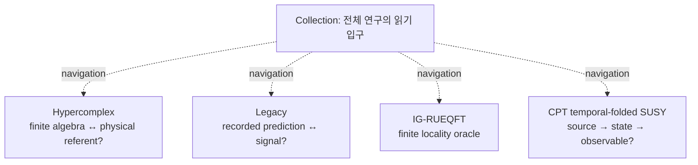

# ICE ORCA DRAGON 연구 직관·KG 지도

2026-09-07 · 읽기용 지도 · **새 과학 claim/evidence/실행 승인을 만들지 않음**.

핵심 직관은 **“추상화 계층을 하나 올릴 때, 아래층의 어떤 정보를 어떤 사상으로 보존하는가?”**다. 예를 들어 방정식의 해를 내적이 있는 상태공간으로 바꾸려면, 해의 존재에 더해 허용 정의역·동치관계·내적을 정해야 한다. 그 내적이 실제 관측가능량과 접합에 양립하는지도 별도 문제다.

이 문서는 collection의 네 독립 graph, CPT의 G1--G5 의존성, 그리고 최근 Starobinsky boundary 연구의 연결을 읽기 위한 지도다. 여기서 **typed handoff**는 다음 층으로 넘길 대상의 종류·정의역·보존 조건을 명시한 연결을 뜻한다. 계산 판정은 각 graph와 raw result에 있고, [기존 intuition 지도](../../research/intuition/ICE_ABSTRACTION_CONNECTIVITY_MAP_2026-09-06.md)와 [geometry--CPT--SUSY 지도](../../research/intuition/ICE_GEOMETRY_CPT_SUSY_INTUITION_MAP_2026-09-03.md)는 더 넓은 질문을 제공한다.

## 1. 네 graph는 서로 다른 질문을 보관한다

| graph | programme ID | 읽을 질문 | 현재 범위 경계 |
| --- | --- | --- | --- |
| CPT temporal-folded SUSY | `cpt::programme:cpt-temporal-folded-susy` | source, cycle, state, observable을 한 compatible chain으로 만들 수 있는가? | G1 original joint relative class와 signed global intersections가 **미구성/OPEN** |
| Hypercomplex | `hypercomplex::programme:hypercomplex-hypothesis-testbench` | 선언한 finite algebra가 물리 referent를 갖는가? | finite identity와 Standard Model referent는 다른 질문 |
| Legacy | `legacy::programme:ice-legacy-predictions` | 기록 예측이 독립적 사전선언과 signal gate를 통과하는가? | 기록된 P01--P15 및 gravity signal은 해당 gate를 통과하지 못함 |
| IG-RUEQFT | `igrueqft::programme:igrueqft-locality-audit` | 제한된 locality oracle의 shortcut은 성립하는가? | frozen free-U(1) oracle의 scoped negative result; interacting continuum은 미판정 |



사용자 원문의 세계관·발견 서사는 [Legacy의 세 층 구분](../../ontology/legacy-predictions/README.md)에서 보존한다. 형식 모델과 검증 가능한 주장은 그 위에서 별도로 읽는다. 다른 graph에서 비슷한 수식·숫자·용어가 나와도 상호 증거가 되지 않는다. 현재 collection의 연결은 탐색용이며, 승격을 위한 독립 consumer는 같은 graph 안에서 확인한다.

## 2. CPT core spine: 해의 존재에서 예측까지는 다섯 문이다

    open:gate1-original-cycle-signed-global-intersections
      → open:gate2-hard-cfu-airy-coefficients
      → open:gate3-full-bfv-pfaffian-pin-holonomy
      → open:gate4-spinorial-charge-domain-constraint-closure
      → open:gate5-persistent-order-and-pole-splitting
      → full-theory / empirical review

| 문 | 직관적 질문 | 실제로 필요한 typed object |
| --- | --- | --- |
| G1 | 원래 적분은 어느 saddle/sheet를 어떤 orientation으로 선택하는가? | regulated joint relative class, complete saddle/sheet/singular/Stokes/good-end census, oriented global intersection vector, homotopy/gauge/regulator stability |
| G2 | 선택된 기여를 regular uniform kernel로 쓸 수 있는가? | hard CFU Airy/Airy-prime coefficients |
| G3 | 접합 orientation과 measure가 실제 양자 BFV/Pin 자료인가? | physical determinant/Pfaffian/Pin line |
| G4 | 실제 fermion-odd spinorial charge가 상태공간과 제약에 양립하는가? | physical charge, positive product, common domain, Pin lift, anomaly-free constraint closure |
| G5 | 효과가 gauge artifact를 넘어 상호작용 pole에 남는가? | persistent gauge-invariant order와 interacting pole splitting |

G1에 국소 결과가 없다는 뜻이 아니다. G1은 **미구성/OPEN**이다. local root, finite endpoint, formal pairing, selected-H RAQ, Lean proof가 있어도 source-defined global coefficient의 대체물은 아니다. 완전하고 안정적인 zero intersection vector도 이 candidate route의 유효한 negative resolution이다. 상세 의존성은 [TOE critical-path routing](../decisions/ICE_TOE_CRITICAL_PATH_ROUTING_2026-09-01.md)을 따른다.


## 3. 최근 CPT typed handoff: 반례가 대상을 더 정확히 만들었다

실선은 선언한 범위에서 기록된 연결, 점선은 아직 필요한 연결이다. 최근 supporting 결과의 위치를 보여주며, G1의 원래 적분 경로를 완성한 도식은 아니다.

| 단계 | scope 안에서 기록된 결과 | 피해야 할 추론 | 다음 handoff |
| --- | --- | --- | --- |
| Ward 소거와 정의역 | [Ward domain](../../cpt_temporal_folded_susy/STAROBINSKY_WARD_DOMAIN.md)은 local flux 소거와 all-ghost Robin/Dirichlet ansatz의 BFV 불변성을 구별 | 경계항이 한 번 사라지면 BFV 연산 뒤에도 같은 경계조건이 유지된다는 주장 | 제약 연산에 불변인 공통 test carrier |
| 같은 Neumann 자료의 pairing | [Cauchy dual](../../cpt_temporal_folded_susy/STAROBINSKY_DUAL_CAUCHY.md)은 same-Neumann full-line KG form이 0임을 확인 | 같은 경계자료에서의 영점이 모든 sewing 또는 모든 state의 부재라는 주장 | 상보 경계자료와 실제 quantum polarization을 분리해 정의 |
| complementary N--D dual | N--D Green pairing은 비퇴화이고 N--N=D--D=0 | complex bilinear pairing을 positive physical metric/CPT와 동일시 | anti-linear CPT, orientation, ghosts, residual BV를 가진 quantum seam kernel |
| observable nonselection | actual first-order strong commutant는 cI+d p_N; kernel/form과 호환하지만 seed/normalization을 선택하지 않음 | formal star 또는 scalar action이 physical state를 선택한다는 주장 | state module에서 실제로 lift되는 nontrivial observable |
| classical endpoint | [quotient lift/BFV boundary](../../cpt_temporal_folded_susy/STAROBINSKY_QUOTIENT_LIFT_BFV_BOUNDARY.md)는 free-ghost fixed-a tangency failure와 ghost-fixed \(L_{q_0}\) endpoint candidate를 구별 | canonical endpoint가 quantum polarization 또는 bulk-induced state라는 주장 | boundary quantization map, polarization/half-density module, bulk-to-endpoint correspondence |
| corrected graded carrier | [primary reduction/graded sewing](../../cpt_temporal_folded_susy/STAROBINSKY_PRIMARY_REDUCTION_GRADED_SEWING.md)은 compact test complex, same-degree coefficient dual, degree-reversed dual을 구별 | 한 dual에서 exact이면 모든 physical state가 trivial이라는 주장 | source가 허용하는 topology/support/primitive와 physical state domain |
| interval source | [source-induced interval BV--BFV](ICE_STAROBINSKY_SOURCE_INDUCED_INTERVAL_BVBFV_2026-09-07.md)는 actual full-primary component action의 local jet split을 기록 | local doublet split이 compact boundary cohomology 또는 original cycle을 자동으로 contract한다는 주장 | full BV gauge-fixing Lagrangian, boundary polarization, actual interval kernel, allowed relative cycle |

### Carrier와 ghost degree를 정확히 구별하기

최근 primary reduction의 정확한 상태는 다음이다.

| complex/carrier | cohomology 또는 pairing | 해석 경계 |
| --- | --- | --- |
| compact-N test complex \(C_{\rm compact}\) | \(H^0=H^1=0\), \(H^2\)는 무한차원 | \(H^0=0\)은 **full state absence가 아니다**. physical ghost degree도 재지정하지 않았다. |
| same-degree continuous coefficient dual | top \(H^2=0\); explicit continuous primitive가 존재 | 명시한 \(C^\infty\) topology의 이 dual에만 적용한다. arbitrary distributions/full graded dual의 결론이 아니다. |
| degree-reversed graded dual | \(T_g\)가 degree \(-2\)의 비영 class로 남고 original detector pairing이 유지 | complex-bilinear pairing이며 positive physical inner product/quantum kernel은 아니다. |

이 차이는 “공간을 크게 만들면 상태가 사라진다”가 아니라, **차수·쌍대화 방식·지지·위상이 바뀌면 질문 자체가 달라진다**는 뜻이다. \(C_{\rm compact}\)의 \(H^2\)와 coefficient dual의 top exactness를 quasi-isomorphism으로 연결하지 않았다.

Lean 4는 이 비교에서 사용한 추상 선형사상과 chain identity를 검증한다. 실제 PDE의 해, collar 지지 조건과 위상에 관한 입력은 인접 analytic derivation에 남아 있다. [PrimaryReduction.lean](../../formal/cpt_sewing/CptSewing/PrimaryReduction.lean)과 [GradedDualSewing.lean](../../formal/cpt_sewing/CptSewing/GradedDualSewing.lean)의 검증 범위를 실제 물리 상태의 존재 증명으로 확대하지 않는다.

### Source-time과 carrier lapse는 같은 적분이 아니다

- N(s)는 interval source의 configuration lapse field이고 s는 source time이다.
- R_N은 boundary/test carrier의 configuration coordinate N 위 적분 사상이다.
- 따라서 R_N의 compact-N homotopy는 source-time path integral, lapse gauge-group average, 혹은 original complex cycle을 실행하거나 정당화하지 않는다.

CMW component convention에서 \(\sigma=e^2-dN/ds\), \(N^+_{\rm new}=N^+-d\sigma^+/ds\)라 두면 local jets에서 source action은 minimal source와 auxiliary sector로 분리되지만, source endpoint action term \(-[\sigma^+\rho]_{\partial I}\)가 남는다. BV cotangent one-form에는 별도로 primitive \(+[\sigma^+\delta N]_{\partial I}\)가 남는다. 두 항은 모두 추적해야 한다. \(\sigma^+=0\)은 allowed variations에서 둘을 함께 없애는 충분한 endpoint restriction일 수 있지만, 그것이 원하는 state, polarization, half-density, 또는 complex integration cycle에 적합하다는 증명은 아직 없다. CMW local jets의 formal split은 compact-N carrier contraction이 아니다.

## 4. 선택과 불변량: 무엇을 검사해야 ‘남는다’고 말할 수 있는가

| 질문 | 선택군/정의역 | 불변 또는 판별 대상 | 현재 금지되는 shortcut |
| --- | --- | --- | --- |
| regulator를 제거해도 residual이 남는가? | declared regulator 및 allowed boundary states | state에 작용한 residual의 limit와 boundary term | 단순한 finite-width nonzero 값을 physical effect로 읽기 |
| observable이 physical candidate인가? | common invariant test domain, constraint/boundary condition | kernel preservation, adjoint/form covariance, 실제 norm/positive product | formal commutator 0 또는 formal star만으로 state selection 선언 |
| seam pairing이 CPT인가? | oriented graded BFV boundary space, polarization, anti-linearity convention | sewing intertwining, signs, residual BV pushforward, mQME | N--D bilinear Green form만으로 CPT/positivity 선언 |
| endpoint doublet를 버릴 수 있는가? | interval endpoint jets와 allowed variations | action endpoint term과 BV primitive의 동시 소거 | bulk-local contractibility를 global boundary quasi-isomorphism으로 확대 |
| local result가 G1을 바꾸는가? | source-defined relative cycle/census/intersection scope | named G1 typed object가 실제로 줄었는지 | later-gate success를 G1 closure로 역투사 |
| 상태가 유일해야 하는가? | 동등한 표현 선택과 서로 다른 seed·양의 weight·extension을 먼저 구별 | 지정한 관측가능량과 내적의 양립, 남는 상태 자유도 | 여러 상태가 허용된다는 사실만으로 이론이 모순이라고 결론 |

이 표의 기준은 [choice-invariance cross-domain decision](../decisions/ICE_CHOICE_INVARIANCE_CROSS_DOMAIN_PROMOTION_2026-09-02.md)의 질문과 같다. “이 효과는 사전 선언한 허용 선택군에서 남으며, 같은 typed mechanism으로 독립된 downstream consumer에 전달되는가?” 지금의 recent sewing results는 이 검사를 위한 domain/endpoint distinction을 정교화했으며, new-physics effect를 세우지 않았다.

## 5. 표준 그래프 엔지니어링은 과학 판정과 역할이 다르다

| 표준 | 이 repository에서 맡는 역할 | 맡지 않는 역할 |
| --- | --- | --- |
| [JSON-LD 1.1](https://www.w3.org/TR/json-ld11/) | graph-qualified identifier와 context를 가진 one-way interchange | export 자체가 claim의 진실 또는 external acceptance를 보장 |
| [PROV-O](https://www.w3.org/TR/prov-o/) | 입력 source document → export activity → 생성 artifact의 계보를 표현 | export 계보가 계산의 과학적 지지나 causal mechanism을 증명 |
| [SHACL 1.0](https://www.w3.org/TR/shacl/) | RDF export의 structural shape 검증 | shape conformity가 물리적 정확성을 검증 |
| native ontology/sidecar | claim/evidence/open/scope와 intuition question을 구별해 탐색 | sidecar question 또는 graph proximity가 evidence edge가 됨 |

구현 정본은 [standards 경계](../../ontology/standards/README.md)다. Native JSON을 정본으로 두고 RDF/JSON-LD로 한 방향 투영하며, SHACL과 SPARQL로 구조와 의미 회귀를 검사한다. 표준 표현을 추가하는 것과 외부 KG에 동일한 존재라고 등록하는 것은 다르다. 현재 외부 대응의 `UNRESOLVED`는 그대로 보존한다.

이번 canonical graph에는 아래 **개념 구분 8개**를 더했다. 기존 claim에서 `ABOUT`으로 연결하고, 원문에는 `CITES`, 이 지도에는 `DOCUMENTED_BY`로 연결한다. `PART_OF`는 CPT programme 소속을 표시한다. 새 `HAS_EVIDENCE`나 `BLOCKED_BY` 관계는 추가하지 않는다.

아래 ID는 모두 `cpt::concept:starobinsky-` 접두사를 갖는다.

| 새 concept ID의 끝부분 | 연결을 읽는 질문 |
| --- | --- |
| `source-time-versus-carrier-lapse-coordinate` | 두 N 적분은 무엇을 적분하는가? |
| `source-boundary-quantization-handoff` | 고전 끝점에서 양자 경계상태로 무엇을 넘기는가? |
| `cohomology-preserving-carrier-comparison` | 공간을 바꿔도 어떤 차수의 class가 보존되는가? |
| `bulk-reduction-and-relative-endpoint-data` | bulk 축약 뒤 끝점에 무엇이 남는가? |
| `observable-common-domain-and-star-product` | 관측가능량과 수반이 같은 허용 공간에 작용하는가? |
| `pairing-versus-positive-state-product` | 비영 pairing에 더해 양의 내적에 무엇이 필요한가? |
| `regulator-limit-versus-boundary-limit` | 규제를 제거한 것과 경계를 제거한 것을 구별했는가? |
| `admissible-choice-invariance-versus-state-selection` | 동등한 표현 선택을 바꾼 것인가, 다른 상태를 고른 것인가? |

## 6. 원문을 따라가는 짧은 독서 경로

```bash
./ice ontology guide --path research-intuition-and-typed-handoffs
./ice ontology guide --graph cpt --path state-sewing-typed-handoffs
./ice ontology guide --graph cpt --path counterexamples-to-state-space-repair
./ice ontology guide --graph cpt --path choice-preservation-and-physical-selection
./ice intuition search "공간을 바꾸면 어떤 상태와 경계 자료가 남는가?" \
  --target cpt::open:starobinsky-seam-ward-boundary-state-limit --json
```

마지막 명령은 이 open problem에 연결한 비권위적 질문 세 개를 찾는다: 코호몰로지 보존, bulk 축약 뒤 끝점 자료, 같은 carrier의 관측가능량·수반·양의 내적. 질문은 계산 결과나 자동 후속 작업이 아니다.

1. 전체 역할: `./ice ontology guide --path cpt-role-bands-no-promotion`
2. core dependency: `./ice ontology guide --graph cpt --path toe-current-critical-path`
3. local-to-global 질문: [9/6 intuition connectivity map](../../research/intuition/ICE_ABSTRACTION_CONNECTIVITY_MAP_2026-09-06.md)
4. recent boundary handoff: [observable selection](../../cpt_temporal_folded_susy/STAROBINSKY_OBSERVABLE_SELECTION_DERIVATION.md) → [canonical endpoint](../../cpt_temporal_folded_susy/STAROBINSKY_QUOTIENT_LIFT_BFV_BOUNDARY_DERIVATION.md) → [kernel/ghost carrier](../../cpt_temporal_folded_susy/STAROBINSKY_KERNEL_CORRECTION_GHOST_SUPPORT_DERIVATION.md) → [primary reduction/graded sewing](../../cpt_temporal_folded_susy/STAROBINSKY_PRIMARY_REDUCTION_GRADED_SEWING.md) → [interval source](ICE_STAROBINSKY_SOURCE_INDUCED_INTERVAL_BVBFV_2026-09-07.md).
5. primary frameworks: [CMR, arXiv:1507.01221v2](https://arxiv.org/abs/1507.01221v2) for polarized states, quantum BFV operator, residual pushforward and mQME; [CMW, arXiv:2012.13270v3](https://arxiv.org/html/2012.13270) for constrained interval component/BV--BFV conventions; and [Giulini--Marolf, gr-qc/9812024v2](https://arxiv.org/abs/gr-qc/9812024v2) for RAQ test-space/domain/observable distinctions.

## 독자에게 남는 질문

좋은 다음 결과는 ‘수식 하나가 맞았다’가 아니라, source와 양립하는 **새 typed object**를 구성하거나 그 object의 존재를 안정적으로 배제하는 것이다. 그 object가 allowed choices와 domains를 지나 observable, normalized prediction, 독립 comparison까지 전달될 때에만 발견 후보가 강해진다. 현재 G1 original cycle, actual BFV/CPT interval kernel, positive physical product 및 original integration cycle은 계속 열린 객체다.
