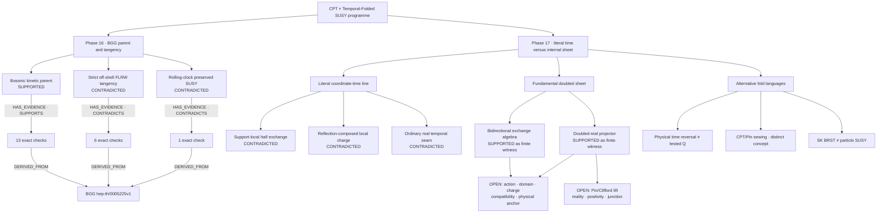

# CPT × Temporal-Folded SUSY ontology guide

> This page is a human-readable memory and index generated from the current repository graph and evidence. It is **not** a preregistration, research contract, substitute for the calculations, scientific canon, or KG ratification.

Canonical machine record: [`graph.json`](./graph.json) (`research-graph/v1`, updated `2026-08-16T16:33:58Z`). Run details live in the [evidence guide](./references/evidence.md); literature coverage lives in the [source inventory](./references/source-inventory.md).

## Quick answers

| Question | Current scoped answer | Trace |
| --- | --- | --- |
| Did the bosonic parent work? | Yes, for the BGG `(X,T,Y)` velocity block after one endpoint removal. This does not include lapse or algebraic auxiliary constraints. | `claim:P16_BGG_BOSONIC_KINETIC_PARENT` |
| Did the specified strict off-shell FLRW truncation work? | No. Exact clean-point witnesses give nonzero discarded `b_i` and spin-3/2 normal components. | `claim:P16_SPECIFIED_OFF_SHELL_FLRW_GAMMA_TRACE_TANGENCY` |
| Does the scoped rolling clock preserve a nonzero SUSY parameter? | No on the declared `W=0`, `F=0`, nonzero-rate Lorentzian-real slice; the parameter map has rank two. This does not remove the underlying local gauge symmetry. | `claim:P16_ROLLING_CHIRAL_CLOCK_BACKGROUND_PRESERVED_SUSY` |
| Can standard support-local `Q` exchange bare `t<0` and `t>0` halves? | No. Both open-half cross blocks vanish by support locality. | `claim:P17_STANDARD_LOCAL_Q_HALF_EXCHANGE` |
| Does composing `Q` with `t→-t` fix that? | It gives a finite-fiber algebra witness, but on the unfolded line it is nonlocal and anticommutes with signed time momentum, so it is not a standard local conserved charge. | `claim:P17_REFLECTION_COMPOSED_Q_IS_STANDARD_LOCAL_CHARGE` |
| What is the most promising surviving route? | A **fundamental internal doubled sheet** admits bidirectional exchange algebra, and a separate doubled-real sheet-mixing projector exists. Their common action, domain, conserved charge, compatibility, positivity, and physical sheet anchor remain open. | `claim:P17_FUNDAMENTAL_DOUBLED_SHEET_EXCHANGE_ALGEBRA`; `claim:P17_DOUBLED_REAL_SHEET_PROJECTOR_WITNESS` |
| Does one-way exchange close? | No under the standard physical adjoint. | `claim:P17_ONE_WAY_SHEET_ARROW_STANDARD_CLOSURE` |
| Does the superalgebra select a unique sheet basis? | No. A continuous unitary mixing family and parity-controlled basis equivalence remain. | `claim:P17_SUPERALGEBRA_SELECTS_SHEET_BASIS` |
| Does an ordinary real temporal seam preserve a nonzero SUSY subalgebra? | No in the single-copy real projector calculation; `v^0` vanishes only for the zero parameter. | `claim:P17_ORDINARY_REAL_TEMPORAL_SEAM_PRESERVES_SUSY` |
| Is physical time reversal itself the supercharge? | No in this analysis. Its anti-complex-linearity and grading make it a discrete operation, not the tested complex-linear fermionic `Q`. | `claim:P17_TIME_REVERSAL_IS_SUPERCHARGE` |
| What role remains for CPT/Pin? | CPT/Pin sewing is retained as a distinct bosonic discrete pairing or real structure between histories, not as the computed supercharge claim. | `concept:cpt-pin-sewing` |
| Is Schwinger–Keldysh BRST particle supersymmetry? | No. The checked quartet is cohomological/ghost graded and is not a positive-energy particle-SUSY construction. | `claim:P17_SK_BRST_IS_PARTICLE_SUPERSYMMETRY` |
| Does any of this show that SUSY does not exist? | No. The graph rules out only the stated truncations and identifications. Phase 16 explicitly leaves full 4D local SUSY and other slices untested; Phase 17 leaves a new doubled construction open. | Phase 16 and Phase 17 scope guards |

## Concept map

The two supported Phase 17 nodes are distinct witnesses. One proves a finite doubled exchange algebra; the other proves a finite real sheet-mixing projector. The graph does not claim that they already coexist in one theory.

## Core distinctions

| Distinction | Meaning in this graph |
| --- | --- |
| Bosonic parent vs off-shell SUSY truncation | Recovering the target bosonic kinetic block does not make a discarded-field locus SUSY-tangent. |
| Gauge symmetry vs preserved background SUSY | A rolling background can have no nonzero Killing parameter while the underlying local SUSY gauge symmetry remains present. |
| Coordinate-time half vs internal sheet | `t<0` and `t>0` are supports on one translated line; a doubled sheet is a new internal degree of freedom carrying complete multiplets. |
| Linear reflection vs physical time reversal | Bare history pullback is complex-linear; Wigner time reversal is anti-complex-linear. Neither fact turns the operation into a conventional fermionic charge. |
| Finite algebra witness vs physical theory | Matrix closure or projector rank is necessary evidence for a route, not an action, self-adjoint domain, conserved charge, or observable. |
| SK BRST vs particle SUSY | SK charges are ghost-odd cohomological controls; the checked signed contour spectrum is not a positive physical Hamiltonian. |

## IDs and claim states

IDs use stable semantic prefixes: `programme:`, `phase:`, `concept:`, `claim:`, `evidence:`, `scope:`, `open:`, `source:`, `artifact:`, and `policy:`. `edge:` IDs identify directed relations; `result:` IDs identify observed run snapshots.

Claim `state` has the following local meaning:

| State | Meaning |
| --- | --- |
| `SUPPORTED` | The attached evidence supports the claim only inside its declared scope. |
| `CONTRADICTED` | The attached evidence contradicts the claim inside its declared scope. |
| `HISTORICAL` | Retained for provenance. Read its summary and attached evidence rather than projecting a current global verdict onto it. |

Historical nodes are retained without turning their `HISTORICAL` state into a new verdict:

| Historical claim ID | Recorded interpretation |
| --- | --- |
| `claim:P15R_BOSONIC_SINGLE_SOURCE_PARENT_EXISTS_IN_FROZEN_CENSUS` | Supporting evidence inside the frozen two-source census; not a literature-wide existence theorem |
| `claim:P15R_FULL_OFFSHELL_SINGLE_SOURCE_PARENT_EXISTS_IN_FROZEN_CENSUS` | Contradicting evidence only inside that census |
| `claim:P14A_LITERAL_BRANCH_SUPERPARTNER` | Inconclusive/unconstructed; Phase 17 tests sharper coordinate-time versions |

## Edge semantics

Every edge is read in stored `from → relation → to` direction.

| Relation | Meaning |
| --- | --- |
| `PART_OF` | Node belongs to a programme or phase. |
| `ABOUT` | Claim concerns a reusable concept. |
| `HAS_EVIDENCE` | Claim points to an evidence group; the edge's `polarity` is `SUPPORTS` or `CONTRADICTS`. |
| `DEFINED_IN` | Evidence checks are implemented in an executable. |
| `RECORDED_IN` | Run evidence is persisted in a result snapshot. |
| `DERIVED_FROM` | Evidence uses a source directly in the calculation. |
| `DOCUMENTED_BY` | Claim has a human-readable report. |
| `DOCUMENTS` | Artifact documents a source or phase. |
| `IMPLEMENTS` | Artifact implements a phase calculation. |
| `RECORDS` | Artifact records a phase result. |
| `VALID_WITHIN` | Claim is bounded by a scope node. |
| `BLOCKED_BY` | Claim cannot be promoted until the named open problem is solved. |
| `MOTIVATES` | A terminal scoped result suggests a distinct follow-up; solving it does not reverse that result. |
| `EXTENDS` | New result adds a scoped case without overwriting an older claim. |
| `FOLLOW_UP_TO` | New claim tests a continuation of an older target. |
| `CONTRASTS_WITH` | New claim sharpens a distinction from an older one. |
| `CITES` | Claim or concept cites a primary or technical source for framing or a boundary. |
| `USES_TOOLING` | Programme points to a tooling reference. |
| `GOVERNED_BY` | Repository workflow relation; never scientific evidence. |

`HAS_EVIDENCE` deliberately runs claim → evidence. A `PASS` inside the evidence means the check succeeded; only edge `polarity` says whether that result supports or contradicts the claim. There is no `SUPERSEDES` edge in the current vocabulary, so no claim should be treated as silently erased.

## Scope ledger

| Scope ID | Included | Important exclusion |
| --- | --- | --- |
| `scope:p15r-frozen-two-source-census` | Hohl and Kallosh as evidential candidates | ADM is only a zero-weight internal control; no literature-wide theorem |
| `scope:p16-bosonic-kinetic` | `(X,T,Y)` velocity block after exactly one endpoint removal | Lapse and algebraic auxiliary constraints |
| `scope:p16-strict-flrw-tangency` | Exact clean-point counterexample on the declared off-shell FLRW/gamma-trace locus | Other truncations or a full all-fermion residual |
| `scope:p16-rolling-clock` | Bosonic `W=0`, `F=0`, nonzero real proper-time rate and Lorentzian-conjugate parameters | Other potentials, auxiliary choices, or Killing-spinor slices |
| `scope:p17-fixed-positive-energy-fiber` | Generic massive rest-frame CAR fiber with `E>0` | Sharp coordinate-time projector representation |
| `scope:p17-literal-time-line` | Unfolded `t∈R`, signed `P_t`, sharp seam at `t=0` | A new internal sheet or nonlocal theory |
| `scope:p17-fundamental-doubled-sheet` | New internal two-sheet degree with complete multiplets | Identification with bare coordinate-time halves |
| `scope:p17-temporal-seam-projector` | Finite real/projector algebra | Pin lift, action, domain, charge, and observable |
| `scope:p17-sk-quartet` | Four-state cohomological control | Completed physical contour Hilbert space and ghost metric |

## Open construction ledger

All entries below have state `OPEN` in the graph.

| Open ID | Missing result |
| --- | --- |
| `open:p17-pin-clifford-lift` | Source-defined reflection lift, square, cocycle, and Majorana bilinear |
| `open:p17-doubled-action` | One real quadratic doubled bulk-plus-interface Lorentzian action |
| `open:p17-gluing-domain` | Variationally admissible `t=0` junction data and a self-adjoint common domain |
| `open:p17-conserved-charge` | Complex-linear fermionic charge acting on that domain with a positive physical adjoint |
| `open:p17-projector-charge-compatibility` | One-domain compatibility of the doubled reality projector and exchange charge |
| `open:p17-physical-sheet-anchor` | Basis-invariant observable distinguishing geometric sheets from internal relabeling |
| `open:p17-reality-positivity-junction` | Simultaneous Majorana reality, positive inner product, and junction consistency |
| `open:p17-sk-full-completion` | Full contour operator algebra and ghost metric |
| `open:full-4d-sugra-interface` | Complete local-SUGRA interface, conserved seam charge, and anomaly-free constraint algebra |

The shortest honest statement of the research frontier is therefore: **finite doubled witnesses exist; a common physical theory does not yet.**

## Repository artifacts

| Phase | Executable | Report | Observed evidence |
| --- | --- | --- | --- |
| 15R | — | — | [`PHASE15R_RUN_RESULT.json`](../../cpt_temporal_folded_susy/PHASE15R_RUN_RESULT.json) |
| 16 | [`phase16_bgg_single_source.py`](../../cpt_temporal_folded_susy/phase16_bgg_single_source.py) | [`PHASE16_BGG_SINGLE_SOURCE.md`](../../cpt_temporal_folded_susy/PHASE16_BGG_SINGLE_SOURCE.md) · [`PHASE16_BGG_SOURCE_NOTES.md`](../../cpt_temporal_folded_susy/PHASE16_BGG_SOURCE_NOTES.md) | [`phase16-result.json`](./evidence/phase16-result.json) |
| 17 | [`phase17_time_line_fold_algebra.py`](../../cpt_temporal_folded_susy/phase17_time_line_fold_algebra.py) | [`PHASE17_TIME_LINE_FOLD_ALGEBRA.md`](../../cpt_temporal_folded_susy/PHASE17_TIME_LINE_FOLD_ALGEBRA.md) | [`phase17-result.json`](./evidence/phase17-result.json) |

The graph also indexes [`docs/SCIENTIFIC_CLI_MANUAL.md`](../../docs/SCIENTIFIC_CLI_MANUAL.md) as tooling. Policy nodes and `GOVERNED_BY` edges describe workflow only; they cannot support or contradict a physics claim.

## External KG bridge memory

The programme has one `EXACT`, `RESOLVED` SYMPOSIUM bridge:

- `programme:cpt-temporal-folded-susy` → `sym:LakatosTree:lakatostree_cpttemporalfoldedsusy_20260809`

Six claim bridges and one concept bridge are `RELATED`, `RESOLVED` pointers to older nodes. In the table, each suffix expands to `sym:LakatosNode:lakatostree_cpttemporalfoldedsusy_20260809/<suffix>`.

| Local node | External UID suffix |
| --- | --- |
| `claim:P17_STANDARD_LOCAL_Q_HALF_EXCHANGE` | `standard-susy-translation-closure` |
| `claim:P17_REFLECTION_COMPOSED_Q_IS_STANDARD_LOCAL_CHARGE` | `hls-local-supercharge-no-go` |
| `claim:P17_REFLECTION_COMPOSED_Q_IS_STANDARD_LOCAL_CHARGE` | `sheet-locality-unfolded-bilocality` |
| `claim:P17_SUPERALGEBRA_SELECTS_SHEET_BASIS` | `exact-unitary-fold-equivalence` |
| `claim:P17_ORDINARY_REAL_TEMPORAL_SEAM_PRESERVES_SUSY` | `fixed-spacelike-seam-rigid-susy-no-go` |
| `claim:P17_DOUBLED_REAL_SHEET_PROJECTOR_WITNESS` | `modified-reality-temporal-projector-route` |
| `concept:cpt-pin-sewing` | `bft-cpt-not-supercharge` |

The two Phase 15R claim lookups and the Phase 17 SK claim lookup remain `UNRESOLVED`. A resolved UID proves only that the target exists. It is not an evidence receipt, equivalence assertion, review outcome, or KG ratification.
