# CPT × Temporal-Folded SUSY ontology guide

> This page is a human-readable memory and index generated from the current repository graph and evidence. It is **not** a preregistration, research contract, substitute for the calculations, scientific canon, or KG ratification.

Canonical machine record: [`graph.json`](./graph.json) (`research-graph/v1`, updated `2026-08-17T04:48:31Z`). Run details live in the [evidence guide](./references/evidence.md); literature coverage lives in the [source inventory](./references/source-inventory.md).

## Quick answers

| Question | Current scoped answer | Trace |
| --- | --- | --- |
| Did the bosonic parent work? | Yes, for the BGG `(X,T,Y)` velocity block after one endpoint removal. This does not include lapse or algebraic auxiliary constraints. | `claim:P16_BGG_BOSONIC_KINETIC_PARENT` |
| Did the specified strict off-shell FLRW truncation work? | No. Exact clean-point witnesses give nonzero discarded `b_i` and spin-3/2 normal components. | `claim:P16_SPECIFIED_OFF_SHELL_FLRW_GAMMA_TRACE_TANGENCY` |
| Does the scoped rolling clock preserve a nonzero SUSY parameter? | No on the declared `W=0`, `F=0`, nonzero-rate Lorentzian-real slice; the parameter map has rank two. This does not remove the underlying local gauge symmetry. | `claim:P16_ROLLING_CHIRAL_CLOCK_BACKGROUND_PRESERVED_SUSY` |
| Can standard support-local `Q` exchange bare `t<0` and `t>0` halves? | No. Both open-half cross blocks vanish by support locality. | `claim:P17_STANDARD_LOCAL_Q_HALF_EXCHANGE` |
| Does composing `Q` with `t→-t` fix that? | It gives a finite-fiber algebra witness, but on the unfolded line it is nonlocal and anticommutes with signed time momentum, so it is not a standard local conserved charge. | `claim:P17_REFLECTION_COMPOSED_Q_IS_STANDARD_LOCAL_CHARGE` |
| What is the most promising surviving route? | A **fundamental internal doubled sheet** admits bidirectional exchange algebra, and a separate doubled-real sheet-mixing projector exists. Their common action, domain, conserved charge, compatibility, positivity, and physical sheet anchor remain open. | `claim:P17_FUNDAMENTAL_DOUBLED_SHEET_EXCHANGE_ALGEBRA`; `claim:P17_DOUBLED_REAL_SHEET_PROJECTOR_WITNESS` |
| Does one-way exchange close? | No under the standard physical adjoint. | `claim:P17_ONE_WAY_SHEET_ARROW_STANDARD_CLOSURE` |
| Does the superalgebra select a unique sheet basis? | No. A continuous unitary mixing family and parity-controlled basis equivalence remain. | `claim:P17_SUPERALGEBRA_SELECTS_SHEET_BASIS` |
| Does an ordinary real temporal seam preserve a nonzero SUSY subalgebra? | No in the single-copy real projector calculation; `v^0` vanishes only for the zero parameter. | `claim:P17_ORDINARY_REAL_TEMPORAL_SEAM_PRESERVES_SUSY` |
| Is physical time reversal itself the supercharge? | No in this analysis. Its anti-complex-linearity and grading make it a discrete operation, not the tested complex-linear fermionic `Q`. | `claim:P17_TIME_REVERSAL_IS_SUPERCHARGE` |
| What role remains for CPT/Pin? | CPT/Pin sewing is retained as a distinct bosonic discrete pairing or real structure between histories, not as the computed supercharge claim. | `concept:cpt-pin-sewing` |
| Is Schwinger–Keldysh BRST particle supersymmetry? | No. The checked quartet is cohomological/ghost graded and is not a positive-energy particle-SUSY construction. | `claim:P17_SK_BRST_IS_PARTICLE_SUPERSYMMETRY` |
| Does elapsed time itself break supersymmetry? | No in the conserved-charge control. If `[H,Q]=0`, a state annihilated by `Q` stays in that kernel under time evolution. | `claim:P18_ELAPSED_TIME_ALONE_BREAKS_SUSY` |
| Can one free instantaneous canonical seam explain missing superpartner pole masses? | No in the frozen Phase 18 class. It can prepare a non-SUSY state, but the post-post retarded B/F poles remain degenerate, and a sharp local kick has divergent energy density. | `claim:P18_FREE_CANONICAL_SEAM_GENERATES_POLE_SPLITTING`; `claim:P18_FREE_SEAM_CAN_PREPARE_NONSUSY_STATE`; `claim:P18_SHARP_SEAM_IS_UV_ADMISSIBLE` |
| Do the displayed closed SUGRA models admit 50–60 accelerated e-folds? | Yes conditionally. Six homogeneous (k=+1) target-shot backgrounds pass the exact turning-point and numerical constraint checks. | `claim:P19_DISPLAYED_TARGET_SHOT_BOUNCES_REACH_50_55_60_NACC` |
| Does time symmetry now predict \(\phi_0\), universe size, or a present SUSY spectrum? | No. The bosonic symmetry data leave \(\phi_0\) free, the radius is conditional, and the displayed stabilizer F directions vanish at their endpoints. | `claim:P19_BOSONIC_TIME_REFLECTION_DATA_LEAVE_PHI0_FREE`; `claim:P19_DISPLAYED_STABILIZER_F_DIRECTIONS_VANISH_AT_ENDPOINT` |
| Does the leading two-sheet WDW control select \(\phi_0=5.442969\)? | No in the constant-field de Sitter envelope. The standard \(e^{2sI}\) history weight and conditional independent-pair \(e^{4sI}\) joint probability are monotone there. This is not an exact two-sheet SUGRA WDW no-go. | `claim:P20_LEADING_DE_SITTER_WDW_ENVELOPE_SELECTS_5P44`; `claim:P20_INDEPENDENT_PAIR_WEIGHT_FOLLOWS_FROM_CPT_SEWING` |
| Is the displayed \(\Omega_{K0}\)–\(T_{\rm reh}\) value a seam prediction? | No. The conversion is reproducible only after fixing the Phase 19 branch, reheating history, units, entropy data, and late-time parameters. | `claim:P20_CONDITIONAL_CURVATURE_REHEATING_CONVERSION_IS_REPRODUCIBLE`; `claim:P20_CURVATURE_REHEATING_NUMBER_IS_A_SEAM_PREDICTION` |
| Does Gaussian normalization automatically give the physical flux probability? | No. It fixes the no-seam baseline at one. A chosen exclusion gives \(R-1\), while \(\log R\) is connected; the physical sector measure and decoherence rule remain open. | `claim:P21_NORMALIZATION_FORCES_ZERO_BRIDGE_SUBTRACTION`; `claim:P21_LOG_R_IS_CONNECTED_VACUUM_GENERATOR`; `claim:P21_R_MINUS_ONE_ALONE_FIXES_PHYSICAL_FLUX_PROBABILITY` |
| Does a positive finite-mode seam density exist? | Yes for one free SUSY oscillator with \(\omega,\beta>0\). The exact purification is normalized and positive, its reduced Gibbs density commutes with the fixed-mode charges, and it passes the equal-source SK trace identity. This is not an unbroken thermal vacuum or a 4D Pin/SUGRA state. | `claim:P22_POSITIVE_FREQUENCY_TFD_LIKE_DENSITY_IS_NORMALIZED_AND_POSITIVE`; `claim:P22_REDUCED_GIBBS_DENSITY_COMMUTES_WITH_FIXED_MODE_SUPERCHARGES`; `claim:P22_FINITE_DENSITY_SATISFIES_EQUAL_SOURCE_SK_NORMALIZATION` |
| Does the same free Gaussian normalize the homogeneous mode? | No in the noncompact \(L^2(\mathbb R)\), \(\omega\to0^+\) limit: the bosonic partition and covariance diverge while the stiffness vanishes. Compact or interacting constrained inflaton modes are not decided. | `claim:P22_FREE_NONCOMPACT_ZERO_MODE_HAS_TRACE_CLASS_TFD_LIMIT` |
| Does any of this show that SUSY does not exist? | No. The graph rules out only the stated truncations and identifications. Phase 16 leaves full 4D local SUSY and other slices untested; Phase 17 leaves a new doubled construction open; Phase 18 leaves interacting self-energies and a persistent carrier open; Phase 19 adds conditional classical backgrounds; Phase 20 excludes one leading selection envelope; Phase 21 identifies a normalized Gaussian baseline; Phase 22 adds a finite-mode density witness and a scoped zero-mode obstruction. | Phase 16–22 scope guards |

## Concept map

```mermaid
flowchart TD
  Programme["CPT × Temporal-Folded SUSY programme"]

  Programme --> P16["Phase 16 · BGG parent and tangency"]
  P16 --> C16A["Bosonic kinetic parent<br/>SUPPORTED"]
  P16 --> C16B["Strict off-shell FLRW tangency<br/>CONTRADICTED"]
  P16 --> C16C["Rolling-clock preserved SUSY<br/>CONTRADICTED"]
  C16A -->|"HAS_EVIDENCE · SUPPORTS"| E16A["13 exact checks"]
  C16B -->|"HAS_EVIDENCE · CONTRADICTS"| E16B["6 exact checks"]
  C16C -->|"HAS_EVIDENCE · CONTRADICTS"| E16C["1 exact check"]
  E16A -->|DERIVED_FROM| BGG["BGG hep-th/0005225v1"]
  E16B -->|DERIVED_FROM| BGG
  E16C -->|DERIVED_FROM| BGG

  Programme --> P17["Phase 17 · literal time versus internal sheet"]
  P17 --> Literal["Literal coordinate-time line"]
  Literal --> L1["Support-local half exchange<br/>CONTRADICTED"]
  Literal --> L2["Reflection-composed local charge<br/>CONTRADICTED"]
  Literal --> L3["Ordinary real temporal seam<br/>CONTRADICTED"]

  P17 --> Double["Fundamental doubled sheet"]
  Double --> D1["Bidirectional exchange algebra<br/>SUPPORTED as finite witness"]
  Double --> D2["Doubled-real projector<br/>SUPPORTED as finite witness"]
  D1 --> Gaps["OPEN: action · domain · charge<br/>compatibility · physical anchor"]
  D2 --> Gaps
  D2 --> Pin["OPEN: Pin/Clifford lift<br/>reality · positivity · junction"]

  P17 --> Alt["Alternative fold languages"]
  Alt --> TR["Physical time reversal ≠ tested Q"]
  Alt --> CPT["CPT/Pin sewing · distinct concept"]
  Alt --> SK["SK BRST ≠ particle SUSY"]

  Programme --> P18["Phase 18 · free temporal-seam spectrum"]
  P18 --> T18["Elapsed time alone breaks SUSY<br/>CONTRADICTED"]
  P18 --> Pole18["Free seam moves B/F poles<br/>CONTRADICTED"]
  P18 --> State18["Free seam prepares non-SUSY state<br/>SUPPORTED as finite witness"]
  P18 --> UV18["Sharp local seam is UV admissible<br/>CONTRADICTED"]
  Pole18 --> Frontier18["OPEN: interacting self-energies · persistent carrier<br/>FRW backreaction · Higgs power sensitivity"]
  State18 --> Frontier18
  UV18 --> Frontier18

  Programme --> P19["Phase 19 · closed SUGRA backgrounds"]
  P19 --> Shift19["Shift trajectory → quadratic potential<br/>SUPPORTED"]
  P19 --> Star19["Cecotti trajectory → Starobinsky potential<br/>SUPPORTED"]
  P19 --> Bounce19["Six target-shot 50/55/60 Nacc backgrounds<br/>SUPPORTED"]
  P19 --> Phi19["Time-reflection data leave phi0 free<br/>SUPPORTED"]
  P19 --> R19["Quadratic r below current limit<br/>CONTRADICTED"]
  P19 --> SR19["Starobinsky first-order r below limit<br/>SUPPORTED"]
  Phi19 --> Open19["OPEN: minisuperspace phi0 measure"]
  SR19 --> Pert19["OPEN: S3 state · perturbations · reheating"]

  Programme --> P20["Phase 20 · leading WDW selection control"]
  P20 --> Peak20["Leading envelope selects 5.44<br/>CONTRADICTED"]
  P20 --> Pair20["CPT automatically gives exp(4sI)<br/>CONTRADICTED"]
  P20 --> Int20["Coherent sum only rescales probability<br/>CONTRADICTED"]
  P20 --> F20["Cecotti 5.44 point is F-flat<br/>CONTRADICTED"]
  P20 --> Curv20["Conditional curvature–reheating map<br/>SUPPORTED"]
  Peak20 --> Exact20["OPEN: exact complex WDW state · current · measure"]
  Pair20 --> Sheet20["OPEN: CPT/Pin sheet inner product"]
  F20 --> Tree20["OPEN: tree-level local-SUGRA WDW constraints"]
  Peak20 --> Loop20["OPEN: local-SUGRA one-loop determinant"]

  Programme --> P21["Phase 21 · connected Gaussian seam"]
  P21 --> Base21["R(C=0)=1 baseline<br/>SUPPORTED"]
  P21 --> Force21["Normalization forces R-1<br/>CONTRADICTED"]
  P21 --> Conn21["R-1 is connected<br/>CONTRADICTED"]
  P21 --> Log21["log R is connected generator<br/>SUPPORTED"]
  P21 --> Tail21["Constant-absolute one-flux sum<br/>SUPPORTED as toy"]
  P21 --> Prob21["R-1 alone fixes WDW probability<br/>CONTRADICTED"]
  Tail21 --> Kernel21["OPEN: three-form SUGRA kernel"]
  Prob21 --> Measure21["OPEN: physical flux measure"]

  Programme --> P22["Phase 22 · finite-mode seam density"]
  P22 --> Dens22["Positive-frequency purification<br/>SUPPORTED as finite control"]
  P22 --> Theta22["Graded anti-linear involution<br/>SUPPORTED as toy real structure"]
  P22 --> SK22["Equal-source SK normalization<br/>SUPPORTED as unitarity"]
  P22 --> Zero22["Free noncompact zero mode is trace class<br/>CONTRADICTED"]
  Dens22 --> Full22["OPEN: homogeneous WDW density · local-SUGRA kernel"]
  Zero22 --> Full22
```

The two supported Phase 17 nodes are distinct witnesses. One proves a finite doubled exchange algebra; the other proves a finite real sheet-mixing projector. The graph does not claim that they already coexist in one theory.

Phase 18 makes a different separation: an instantaneous free canonical seam can alter occupations and Wightman data without changing the common post-post retarded pole. This is a state-preparation witness, not a permanent soft-mass mechanism, and the unsmoothed local scalar kick is UV inadmissible.

Phase 19 adds gravity only at the homogeneous classical-background level. It verifies two exact one-field SUGRA reductions and six conditional closed-FRW shooting solutions. The rows prove existence after choosing a target \(N_{\rm acc}\); they do not show that CPT/Pin selects \(\phi_0\), construct a quantum state, or predict a parameter-free universe size.

Phase 20 tests one leading selection proposal rather than solving the exact WDW problem. The constant-field de Sitter envelope is monotone at the Phase 19 benchmark under both the standard \(e^{2sI}\) history weight and a separately assumed independent-pair \(e^{4sI}\) joint probability. Coherent phases, a WDW current, the sheet inner product, the exact complex saddle, and local-SUGRA loop sectors remain outside that result.

Phase 21 replaces a guessed pair weight by an explicit positive finite Gaussian ratio. It proves that normalization identifies a unit no-seam term, but also proves that subtracting it is not forced and that \(R-1\) is not the connected functional. The one-flux convergence witness remains a toy because the kernel, sector measure, WDW inner product/current, and joint \((n,\phi)\) peak are not derived.

Phase 22 constructs a different finite witness: a normalized thermofield-double-like purification of one
supersymmetric oscillator. Its Gibbs covariance, graded occupation-space real structure, DtN density
correlation, and equal-source SK trace identity are exact. Finite temperature has positive energy, so this
is not an unbroken positive-Hamiltonian SUSY vacuum; the toy involution is not a spacetime Pin lift. The
same noncompact free ansatz fails at \(\omega=0\), leaving the constrained homogeneous WDW and
gravitino–Goldstino–ghost completions open.

## Core distinctions

| Distinction | Meaning in this graph |
| --- | --- |
| Bosonic parent vs off-shell SUSY truncation | Recovering the target bosonic kinetic block does not make a discarded-field locus SUSY-tangent. |
| Gauge symmetry vs preserved background SUSY | A rolling background can have no nonzero Killing parameter while the underlying local SUSY gauge symmetry remains present. |
| Coordinate-time half vs internal sheet | `t<0` and `t>0` are supports on one translated line; a doubled sheet is a new internal degree of freedom carrying complete multiplets. |
| Linear reflection vs physical time reversal | Bare history pullback is complex-linear; Wigner time reversal is anti-complex-linear. Neither fact turns the operation into a conventional fermionic charge. |
| Finite algebra witness vs physical theory | Matrix closure or projector rank is necessary evidence for a route, not an action, self-adjoint domain, conserved charge, or observable. |
| SK BRST vs particle SUSY | SK charges are ghost-odd cohomological controls; the checked signed contour spectrum is not a positive physical Hamiltonian. |
| Elapsed time vs SUSY-breaking dynamics | Conserved evolution with `[H,Q]=0` does not break SUSY. A seam can fail to preserve a SUSY domain, but that is a property of the seam data, not of time passing. |
| Free canonical temporal seam (`concept:free-canonical-temporal-seam`) | An instantaneous standard Cauchy-data map preserves scalar symplectic flux or the finite-mode fermion CAR while leaving the future bulk operators unchanged. |
| Initial state vs spectral pole (`concept:initial-state-versus-spectral-pole`) | Occupations, anomalous correlators, and Wightman functions can remember a seam while the free retarded commutator keeps the unchanged bulk pole. |
| One-time excitation vs persistent carrier (`concept:persistent-susy-breaking-carrier`) | A non-SUSY state does not by itself supply a nondecaying `F`/`D` order parameter, memory sector, vacuum selection, or bulk soft spurion. |
| Sharp kick vs admissible smoothing | The spatially local delta kick has linearly divergent number density and quadratically divergent energy density; the Gaussian result is only a bounded Born/numerical control, not a constructed UV completion. |
| Potential scale vs geometric Hubble rate | \(H_V^2=V/3\) is used in the transverse SUGRA masses; the closed-FRW \(H(t)^2\) vanishes at the symmetric bounce. |
| Background existence vs initial-amplitude selection | Target shooting can prove a branch exists while leaving \(\phi_0\) unselected. A perturbation Gaussian state and a minisuperspace/background measure are separate constructions. |
| \(N_{\rm acc}\) vs \(N_*\) | Bounce-to-end accelerated e-folds are not automatically the CMB pivot e-fold count without reheating and scale matching. |
| Standard history vs independent-pair probability | \(e^{2sI}\) is the recorded standard semiclassical one-history weight. \(e^{4sI}\) is a conditional joint probability for an independently factorized pair; CPT sewing alone does not derive it. |
| Envelope monotonicity vs exact WDW no-go | A nonzero slope in the constant-field de Sitter control rules out a peak in that envelope, not every complex Starobinsky saddle, WDW measure, sheet overlap, or loop-corrected local-SUGRA state. |
| Constant normalization vs coherent interference | A constant factor cannot move an envelope slope, but an order-one phase-dependent \(\cos^2S\) term can create nodes and local extrema until a current/decoherence prescription is supplied. |
| Conditional conversion vs prediction | Reproducing \(\Omega_{K0}(T_{\rm reh})\) after fixing \(N\), \(M_s\), \(w_{\rm reh}\), entropy, and late-time inputs does not mean the seam selected any of them. |
| Unit baseline vs forced subtraction | Decoupled-sheet normalization gives \(R(0)=1\); using \(R-1\) additionally chooses to exclude the zero-insertion term. |
| Remainder vs connected generator | \(R-1=\exp(\log R)-1\) includes products of connected rings; \(\log R\) is the linked-cluster generator. |
| Finite determinant vs universe probability | A regulated or summable positive sequence still needs a physical sector measure, WDW current/inner product or decoherence functional before it can be called a probability. |
| Gibbs covariance vs unbroken vacuum SUSY | \([\rho,Q]=0\) and equal multiplet weights do not make a finite-temperature state a zero-energy SUSY vacuum; Phase 22 checks \(\langle H\rangle>0\). |
| Occupation-space real structure vs Pin lift | The graded anti-linear toy involution fixes the displayed finite state, but omits spacetime Clifford reflection, spin structure, reflection square, and local-SUGRA gluing. |
| DtN amplitude vs density covariance | If the Euclidean amplitude is \(e^{-q^TKq/2}\), the probability density has covariance \((2K)^{-1}\), not \(K^{-1}\). |
| Free noncompact zero mode vs inflaton minisuperspace | Divergence of the \(L^2(\mathbb R)\) free oscillator limit does not decide a compact mode or an interacting constrained \((a,\phi)\) wavefunction. |

## IDs and claim states

IDs use stable semantic prefixes: `programme:`, `phase:`, `concept:`, `claim:`, `evidence:`, `scope:`, `open:`, `source:`, `artifact:`, and `policy:`. `edge:` IDs identify directed relations; `result:` IDs identify observed run snapshots.

Claim `state` has the following local meaning:

| State | Meaning |
| --- | --- |
| `SUPPORTED` | The attached evidence supports the claim only inside its declared scope. |
| `CONTRADICTED` | The attached evidence contradicts the claim inside its declared scope. |
| `HISTORICAL` | Retained for provenance. Read its summary and attached evidence rather than projecting a current global verdict onto it. |

Historical nodes are retained without turning their `HISTORICAL` state into a new verdict:

| Historical claim ID | Recorded interpretation |
| --- | --- |
| `claim:P15R_BOSONIC_SINGLE_SOURCE_PARENT_EXISTS_IN_FROZEN_CENSUS` | Supporting evidence inside the frozen two-source census; not a literature-wide existence theorem |
| `claim:P15R_FULL_OFFSHELL_SINGLE_SOURCE_PARENT_EXISTS_IN_FROZEN_CENSUS` | Contradicting evidence only inside that census |
| `claim:P14A_LITERAL_BRANCH_SUPERPARTNER` | Inconclusive/unconstructed; Phase 17 tests sharper coordinate-time versions |

## Edge semantics

Every edge is read in stored `from → relation → to` direction.

| Relation | Meaning |
| --- | --- |
| `PART_OF` | Node belongs to a programme or phase. |
| `ABOUT` | Claim concerns a reusable concept. |
| `HAS_EVIDENCE` | Claim points to an evidence group; the edge's `polarity` is `SUPPORTS` or `CONTRADICTS`. |
| `DEFINED_IN` | Evidence checks are implemented in an executable. |
| `RECORDED_IN` | Run evidence is persisted in a result snapshot. |
| `DERIVED_FROM` | Evidence uses a source directly in the calculation. |
| `DOCUMENTED_BY` | Claim has a human-readable report. |
| `DOCUMENTS` | Artifact documents a source or phase. |
| `IMPLEMENTS` | Artifact implements a phase calculation. |
| `RECORDS` | Artifact records a phase result. |
| `VALID_WITHIN` | Claim is bounded by a scope node. |
| `BLOCKED_BY` | Claim cannot be promoted until the named open problem is solved. |
| `MOTIVATES` | A terminal scoped result suggests a distinct follow-up; solving it does not reverse that result. |
| `EXTENDS` | New result adds a scoped case without overwriting an older claim. |
| `FOLLOW_UP_TO` | New claim tests a continuation of an older target. |
| `CONTRASTS_WITH` | New claim sharpens a distinction from an older one. |
| `CITES` | Claim, concept, or open problem cites a primary or technical source for framing or a boundary. |
| `USES_TOOLING` | Programme points to a tooling reference. |
| `GOVERNED_BY` | Repository workflow relation; never scientific evidence. |

`HAS_EVIDENCE` deliberately runs claim → evidence. A `PASS` inside the evidence means the check succeeded; only edge `polarity` says whether that result supports or contradicts the claim. There is no `SUPERSEDES` edge in the current vocabulary, so no claim should be treated as silently erased.

## Scope ledger

| Scope ID | Included | Important exclusion |
| --- | --- | --- |
| `scope:p15r-frozen-two-source-census` | Hohl and Kallosh as evidential candidates | ADM is only a zero-weight internal control; no literature-wide theorem |
| `scope:p16-bosonic-kinetic` | `(X,T,Y)` velocity block after exactly one endpoint removal | Lapse and algebraic auxiliary constraints |
| `scope:p16-strict-flrw-tangency` | Exact clean-point counterexample on the declared off-shell FLRW/gamma-trace locus | Other truncations or a full all-fermion residual |
| `scope:p16-rolling-clock` | Bosonic `W=0`, `F=0`, nonzero real proper-time rate and Lorentzian-conjugate parameters | Other potentials, auxiliary choices, or Killing-spinor slices |
| `scope:p17-fixed-positive-energy-fiber` | Generic massive rest-frame CAR fiber with `E>0` | Sharp coordinate-time projector representation |
| `scope:p17-literal-time-line` | Unfolded `t∈R`, signed `P_t`, sharp seam at `t=0` | A new internal sheet or nonlocal theory |
| `scope:p17-fundamental-doubled-sheet` | New internal two-sheet degree with complete multiplets | Identification with bare coordinate-time halves |
| `scope:p17-temporal-seam-projector` | Finite real/projector algebra | Pin lift, action, domain, charge, and observable |
| `scope:p17-sk-quartet` | Four-state cohomological control | Completed physical contour Hilbert space and ghost metric |
| `scope:p18-free-instantaneous-seam` | Flat 3+1-dimensional equal-mass free Wess–Zumino mode control; instantaneous canonical Cauchy-data map; unchanged future bulk operators; post-post retarded-pole mass | Energy/time-nonlocal kernels, higher-time-derivative data, persistent carrier or bath, interactions, a full doubled Wess–Zumino Pin/common-domain construction, absolute scale, and Standard Model Higgs physics |
| `scope:p18-uv-and-conditional-controls` | Sharp-kick cutoff integrals, Gaussian Born/numerical control, collisionless FRW dilution, and an inserted soft-term benchmark | Interacting Wigner self-energies, backreaction, thermalization, an absolute mass prediction, and a computed Higgs cancellation |
| `scope:p19-exact-one-field-sugra-trajectories` | Exact F-term reductions, recorded path-local Hessians, \(H_V\) convention, endpoint F directions | Full covariant multifield stability, fermionic/off-shell CPT/Pin seam, present soft spectrum |
| `scope:p19-classical-homogeneous-closed-frw-shooting` | Classical \(k=+1\) turning-point data, target shooting, constraint monitoring | \(\phi_0\) selection, quantum state, perturbations, uniqueness, parameter-free universe size |
| `scope:p19-first-order-potential-slow-roll-r` | First-order potential slow-roll \(r\) at selected \(N_*\) | Reheating map, closed-\(S^3\) perturbations, full \(n_s,r\) likelihood viability |
| `scope:p20-leading-de-sitter-wdw-control` | Constant-field hemisphere exponent, standard history weight, conditional independent-pair joint probability, exact slopes, coherent-sum identity | Exact complex Starobinsky saddle, WDW current/measure/factor ordering, CPT/Pin sheet inner product, local-SUGRA sectors, exact no-go |
| `scope:p20-cecotti-path-f-flatness` | Classical \(D_SW\), inverse metric, \(F^S\), and positive-real static F-flat point on the displayed path | Quantum local-SUSY wavefunction support, closed-bounce Killing spinor, fermionic CPT/Pin boundary condition |
| `scope:p20-conditional-curvature-reheating-benchmark` | One Phase 19 branch, \(w_{\rm reh}=0\), entropy conservation, explicit units, signed \(\Omega_K\) | Seam-selected amplitude/reheating, curvature detection, uncertainties/global likelihood, other thermal histories |
| `scope:p21-positive-euclidean-gaussian` | Positive finite real-boson Gaussian determinant, covariance, Schur and linked-cluster algebra | Lorentzian/OS field theory, fermionic phases, SUGRA kernel, WDW probability |
| `scope:p21-single-flux-tail-toy` | One integer flux, two explicit kernel scalings, tail and prior comparisons | Derived sector measure, joint \((n,\phi)\), membrane rate, inflationary selection |
| `scope:p22-positive-frequency-finite-mode-density` | One free SUSY oscillator, \(\omega,\beta>0\), explicit doubled purification and finite trace functional | Infinite-mode UV product, 4D Pin, BRST, WDW measure, observables |
| `scope:p22-noncompact-zero-mode-limit` | Fixed \(\beta>0\), \(\omega\to0^+\) in the original noncompact \(L^2(\mathbb R)\) oscillator representation | Compact regulators and interacting/gravitational inflaton minisuperspace |

## Open construction ledger

All entries below have state `OPEN` in the graph.

| Open ID | Missing result |
| --- | --- |
| `open:p17-pin-clifford-lift` | Source-defined reflection lift, square, cocycle, and Majorana bilinear |
| `open:p17-doubled-action` | One real quadratic doubled bulk-plus-interface Lorentzian action |
| `open:p17-gluing-domain` | Variationally admissible `t=0` junction data and a self-adjoint common domain |
| `open:p17-conserved-charge` | Complex-linear fermionic charge acting on that domain with a positive physical adjoint |
| `open:p17-projector-charge-compatibility` | One-domain compatibility of the doubled reality projector and exchange charge |
| `open:p17-physical-sheet-anchor` | Basis-invariant observable distinguishing geometric sheets from internal relabeling |
| `open:p17-reality-positivity-junction` | Simultaneous Majorana reality, positive inner product, and junction consistency |
| `open:p17-sk-full-completion` | Full contour operator algebra and ghost metric |
| `open:full-4d-sugra-interface` | Complete local-SUGRA interface, conserved seam charge, and anomaly-free constraint algebra |
| `open:p18-interacting-wigner-self-energies` | Late-time interacting boson and fermion retarded Wigner self-energies after an admissible seam state |
| `open:p18-persistent-order-parameter` | A finite-energy CPT/Pin-compatible nondecaying `F`/`D` order parameter, memory sector, or vacuum-selection mechanism |
| `open:p18-frw-backreaction` | Expansion with interactions, thermalization, and backreaction beyond the conditional collisionless `a^-2` and `a^-3` controls |
| `open:p18-higgs-power-sensitivity` | Regulator-independent Higgs power-sensitivity calculation in a consistent interacting doubled parent |
| `open:p19-minisuperspace-phi0-measure` | A background wavefunction, seam path integral, or measure that predictively weights \(\phi_0\) |
| `open:p19-cpt-pin-perturbation-state` | A CPT/Pin-compatible Hadamard/Wronskian perturbation state on a fixed background |
| `open:p19-closed-s3-perturbations` | Discrete scalar/tensor propagation through the closed bounce |
| `open:p19-reheating-pivot-map` | Reheating and the map from \(N_{\rm acc}\) to observational \(N_*\) |
| `open:p19-full-covariant-multifield-stability` | Complete covariant scalar and fermionic SUGRA stability along the bounce |
| `open:p20-exact-starobinsky-wdw-state` | Exact complex scalar-gravity saddle, WDW current or decoherent-histories measure, and fixed factor ordering |
| `open:p20-cpt-pin-sheet-inner-product` | A doubled Hilbert space and sewing action that derive normalization, overlap, and the physical joint-probability rule |
| `open:p20-local-sugra-wdw-constraint` | Tree-level Cecotti local-SUGRA Hamiltonian/SUSY constraints, wavefunction components, factor ordering, and sheet boundary data |
| `open:p20-local-sugra-one-loop-selection` | Gauge-fixed boson–fermion–gravitino determinant including ghosts, zero modes, and renormalization |
| `open:p20-quantized-four-form-selection` | UV-fixed discrete flux selection without tuning couplings to \(5.44\) |
| `open:p20-seam-reheating-curvature-prediction` | Joint seam derivation of initial amplitude, reheating dynamics, and a present curvature distribution |
| `open:p21-three-form-seam-kernel` | Flux- and harmonic-dependent cross-sheet kernel derived from compact three-form SUGRA or a charged-membrane saddle |
| `open:p21-physical-flux-measure` | Physical sector measure and WDW current/inner product or decoherence functional yielding a finite joint \((n,\phi)\) distribution |
| `open:p22-homogeneous-minisuperspace-density` | Constrained complex-cap homogeneous density with zero-mode measure, collective-coordinate Jacobian, and physical WDW current |
| `open:p22-gauge-fixed-local-sugra-seam-density` | Coupled gravitino–Goldstino–ghost boundary operator, physical projector, positivity, and trace-class test |

The shortest honest statement of the research frontier is therefore: **finite doubled, Gaussian, and positive-frequency density witnesses plus conditional closed backgrounds exist; the leading WDW envelope does not select \(5.44\), the normalized Gaussian does not supply a universe probability, and the free noncompact zero mode is not trace class. Neither an exact predictive background-selection rule nor a full projected local-SUGRA seam density with persistent spectral breaking exists yet.**

## Repository artifacts

| Phase | Executable | Report | Observed evidence |
| --- | --- | --- | --- |
| 15R | — | — | [`PHASE15R_RUN_RESULT.json`](../../cpt_temporal_folded_susy/PHASE15R_RUN_RESULT.json) |
| 16 | [`phase16_bgg_single_source.py`](../../cpt_temporal_folded_susy/phase16_bgg_single_source.py) | [`PHASE16_BGG_SINGLE_SOURCE.md`](../../cpt_temporal_folded_susy/PHASE16_BGG_SINGLE_SOURCE.md) · [`PHASE16_BGG_SOURCE_NOTES.md`](../../cpt_temporal_folded_susy/PHASE16_BGG_SOURCE_NOTES.md) | [`phase16-result.json`](./evidence/phase16-result.json) |
| 17 | [`phase17_time_line_fold_algebra.py`](../../cpt_temporal_folded_susy/phase17_time_line_fold_algebra.py) | [`PHASE17_TIME_LINE_FOLD_ALGEBRA.md`](../../cpt_temporal_folded_susy/PHASE17_TIME_LINE_FOLD_ALGEBRA.md) | [`phase17-result.json`](./evidence/phase17-result.json) |
| 18 | [`phase18_gaussian_seam_spectrum.py`](../../cpt_temporal_folded_susy/phase18_gaussian_seam_spectrum.py) | [`PHASE18_GAUSSIAN_SEAM_SPECTRUM.md`](../../cpt_temporal_folded_susy/PHASE18_GAUSSIAN_SEAM_SPECTRUM.md) | [`phase18-result.json`](./evidence/phase18-result.json) |
| 19 | [`phase19_closed_sugra_bounce.py`](../../cpt_temporal_folded_susy/phase19_closed_sugra_bounce.py) | [`PHASE19_CLOSED_SUGRA_BOUNCE.md`](../../cpt_temporal_folded_susy/PHASE19_CLOSED_SUGRA_BOUNCE.md) | [`phase19-result.json`](./evidence/phase19-result.json) |
| 20 | [`phase20_two_sheet_wdw_selection.py`](../../cpt_temporal_folded_susy/phase20_two_sheet_wdw_selection.py) | [`PHASE20_TWO_SHEET_WDW_SELECTION.md`](../../cpt_temporal_folded_susy/PHASE20_TWO_SHEET_WDW_SELECTION.md) | [`phase20-result.json`](./evidence/phase20-result.json) |
| 21 | [`phase21_connected_seam_gaussian.py`](../../cpt_temporal_folded_susy/phase21_connected_seam_gaussian.py) | [`PHASE21_CONNECTED_SEAM_GAUSSIAN.md`](../../cpt_temporal_folded_susy/PHASE21_CONNECTED_SEAM_GAUSSIAN.md) | [`phase21-result.json`](./evidence/phase21-result.json) |
| 22 | [`phase22_finite_mode_seam_density.py`](../../cpt_temporal_folded_susy/phase22_finite_mode_seam_density.py) | [`PHASE22_FINITE_MODE_SEAM_DENSITY.md`](../../cpt_temporal_folded_susy/PHASE22_FINITE_MODE_SEAM_DENSITY.md) | [`phase22-result.json`](./evidence/phase22-result.json) |

The graph also indexes [`docs/SCIENTIFIC_CLI_MANUAL.md`](../../docs/SCIENTIFIC_CLI_MANUAL.md) as tooling. Policy nodes and `GOVERNED_BY` edges describe workflow only; they cannot support or contradict a physics claim.

## External KG bridge memory

The programme has one `EXACT`, `RESOLVED` SYMPOSIUM bridge:

- `programme:cpt-temporal-folded-susy` → `sym:LakatosTree:lakatostree_cpttemporalfoldedsusy_20260809`

Six claim bridges and one concept bridge are `RELATED`, `RESOLVED` pointers to older nodes. In the table, each suffix expands to `sym:LakatosNode:lakatostree_cpttemporalfoldedsusy_20260809/<suffix>`.

| Local node | External UID suffix |
| --- | --- |
| `claim:P17_STANDARD_LOCAL_Q_HALF_EXCHANGE` | `standard-susy-translation-closure` |
| `claim:P17_REFLECTION_COMPOSED_Q_IS_STANDARD_LOCAL_CHARGE` | `hls-local-supercharge-no-go` |
| `claim:P17_REFLECTION_COMPOSED_Q_IS_STANDARD_LOCAL_CHARGE` | `sheet-locality-unfolded-bilocality` |
| `claim:P17_SUPERALGEBRA_SELECTS_SHEET_BASIS` | `exact-unitary-fold-equivalence` |
| `claim:P17_ORDINARY_REAL_TEMPORAL_SEAM_PRESERVES_SUSY` | `fixed-spacelike-seam-rigid-susy-no-go` |
| `claim:P17_DOUBLED_REAL_SHEET_PROJECTOR_WITNESS` | `modified-reality-temporal-projector-route` |
| `concept:cpt-pin-sewing` | `bft-cpt-not-supercharge` |

The two Phase 15R claim lookups and the Phase 17 SK claim lookup remain `UNRESOLVED`. Phase 18 adds four more unresolved lookups, one for each scoped claim:

- `claim:P18_ELAPSED_TIME_ALONE_BREAKS_SUSY`
- `claim:P18_FREE_CANONICAL_SEAM_GENERATES_POLE_SPLITTING`
- `claim:P18_FREE_SEAM_CAN_PREPARE_NONSUSY_STATE`
- `claim:P18_SHARP_SEAM_IS_UV_ADMISSIBLE`

There are therefore seven expected unresolved bridges in the current graph. No external UID was invented for the four new lookups. A resolved UID proves only that the target exists; it is not an evidence receipt, equivalence assertion, review outcome, or KG ratification.
