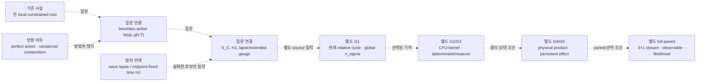

# 국소 연속 해에서 물리적 관측량까지: 직관 연결 지도

2026-09-06. 상태: **NON_AUTHORITATIVE_HYPOTHESIS_GENERATION**.

이 문서는 이미 기록된 결과와 open problem을 읽기 쉽게 잇는 지도다. 새 과학 결과,
canonical claim, evidence edge, 실행 순서, 또는 계산 요청을 만들지 않는다. canonical
판정은 계속 [CPT graph](../../ontology/cpt-temporal-folded-susy/graph.json)에 있고, 기계
조회용 질문은 [`scientific-intuition-signals.v2.json`](./scientific-intuition-signals.v2.json)에
있다. 여기의 화살표는 사람이 다음 질문을 고르는 순서일 뿐, 증명된 유도나 자동 작업 흐름이
아니다.

## 이 지도를 읽는 법

| 표지 | 뜻 |
| --- | --- |
| **기존 사실** | 링크된 원래 결과가 선언한 범위의 기록 |
| **질문 연결** | 두 대상을 잇기 위해 아직 정의·검증해야 하는 interface |
| **방법 비유** | 같은 형식의 문제를 다루는 문헌·toy control. ICE 결과가 아님 |
| **범위 반례** | 특정 후보를 배제한 기록. 더 큰 후보 전체의 no-go가 아님 |
| **구별** | 비슷한 말이지만 서로 대신할 수 없는 객체 |

가장 중요한 구별은 **해가 존재한다**와 **그 해가 원래 적분 cycle에서 기여한다** 사이다.
또한 고전 action의 합성과 양자 amplitude의 합성, amplitude와 positive physical state,
minisuperspace와 full 3+1 parent는 각각 다른 질문이다.

## Worked example — 현재 local root를 과장하지 않고 읽기

출발점은 [continuum endpoint certificate](../../docs/research/ICE_STAROBINSKY_CONTINUUM_ENDPOINT_CERTIFICATE_2026-09-06.md)다.
그것은 선언한 동일 양끝값과 작은 box에서 \(F(u_-,v_-,T)=0\)인 유일한 regular 실수
root를 인증한다. 따라서 이 root는 “한 연속 branch를 이름 붙여 다시 찾을 수 있다”는
**기존 사실**이다. fixed boundary 하나에서의 3차원 constrained shooting regularity는,
바로 \(W(q_L,q_R;T)\)가 경계 근방에서 존재한다는 뜻은 아니다.

다음 질문 연결은 fixed \(T\)에서 양끝 configuration을 바꾸어도 full Euler–Lagrange
해가 유일하게 계속되는지, on-shell Dirichlet action이 \(W\)를 이루는지다. 여기에는
fixed-\(T\) \(2\times2\) endpoint regularity, action/momentum variation, no-conjugate-point
control이 필요하다. 그 뒤에만 lapse stationary branch를 통해 constrained principal
function \(S_C\), endpoint Hamilton–Jacobi constraint, interface momentum matching을 물을
수 있다. 두 구간을 붙이는 것은 “같은 궤적을 두 번 그리기”가 아니라, interface의
configuration·momentum·lapse 정보를 어떤 quotient에서 extremize하는지 정하는 일이다.

그래도 \(S_C\)나 local gauge identity가 original cycle을 선택하지는 않는다. G1의
[`open:gate1-original-cycle-signed-global-intersections`](../../ontology/cpt-temporal-folded-susy/graph.json)는
source-defined regulated relative class, 완전한 saddle/sheet/singular/Stokes/good-end census,
orientation, 그리고 안정적인 global \(n_\sigma\)를 별도로 요구한다. 선택된 global
contribution이 있어야 G2의 uniform CFU/Airy kernel과 G3의 absolute determinant/Pfaffian/Pin
line을 통해 amplitude를 묻는다. amplitude가 있다고 physical state가 되는 것도 아니다:
G4의 positive product/common domain/constraint closure와 G5의 persistent gauge-invariant
interacting effect가 따로 남는다. 마지막으로 full 3+1 local modes와 arbitrary-background
closure, continuum/UV, normalized observable, likelihood가 있어야 관측으로 간다.

이 흐름은 현재 TOE 의존 경로의 사람이 읽는 버전이다. [TOE routing](../../docs/decisions/ICE_TOE_CRITICAL_PATH_ROUTING_2026-09-01.md)은 G1이 첫 core blocker이며 local root를
자동 core progress로 세지 않는다고 명시한다.

## 세 읽기 경로

### A. 한 local 결과에서 더 큰 객체를 묻기

1. certificate에서 정확히 무엇이 root로 인증되었는지 읽는다.
2. \(W(q_L,q_R;T)\)를 정의하려면 무엇이 추가로 필요한지 묻는다.
3. \(S_C\), composition, extended gauge identity가 각각 어떤 별도 interface인지 구별한다.
4. local saddle data와 G1 original-cycle selection을 분리한다.

이 경로의 질문 signal은
`intuition:continuum-root-to-boundary-action` 및
`intuition:boundary-composition-and-gauge`다. 둘은
`open:gate1-starobinsky-exact-gauge-preserving-element-source`를 향한 후보 lens이며,
그 open problem의 해답이나 action의 존재 주장이 아니다.

### B. 반례에서 남는 대안을 정확히 고르기

[`naive local-lapse audit`](../../cpt_temporal_folded_susy/GATE1_M2_STAROBINSKY_NAIVE_LOCAL_LAPSE_GAUGE_TEST.md)은
선언한 \(m=2\) local-lapse 후보에서 gauge zero mode가 없음을 기록했다.
[`midpoint fixed-time HJ audit`](../../cpt_temporal_folded_susy/GATE1_M2_STAROBINSKY_MIDPOINT_HJ_IDENTITY_AUDIT.md)은
선언한 fixed-time midpoint 동일성이 witness 영역에서 실패함을 기록했다. 둘 다
**범위 반례**다. 그러므로 각각의 실패 가정, lapse-extremized constrained principal action,
그리고 full lapse/embedding gauge structure를 한 이름으로 합치지 않는다.

이 경로의 signal `intuition:midpoint-counterexample-to-source-alternatives`는 “어떤
후보가 배제됐고 무엇은 아직 질문으로 남는가?”를 묻는다. 반례를 perfect action이나
continuum limit 전체의 universal no-go로 바꾸지 않는다.

### C. amplitude, state, full parent를 한 줄로 섞지 않기

G1의 global coefficient는 saddle가 적분에 기여하는가의 질문이다. G2/G3는 선택된
contribution의 uniform kernel, phase, normalization, determinant line과 gluing measure의
질문이다. G4/G5는 common physical domain, positive product, charge/constraint closure,
persistent spectrum의 질문이다. 이들은 순서상 인접해 보여도 서로의 대용물이 아니다.

`intuition:global-selection-to-uniform-amplitude`는
`open:gate2-hard-cfu-airy-coefficients`를, `intuition:classical-action-versus-quantum-measure`는
`open:gate3-full-bfv-pfaffian-pin-holonomy`를 향한다. 기존
`intuition:ice-cpt-pin-sewing-versus-physical-cross-sheet-charge`와
`intuition:ice-persistent-breaking-to-cross-domain-observable`은 각각 G4와 G5의 이미
존재하는 lens다. 이 네 signal은 같은 physical claim의 네 증거가 아니라 서로 다른
missing object를 묻는 질문들이다.

full-theory 질문은 마지막에 남는다. `intuition:reduced-solution-to-parent-scope`는
full 3+1 local modes, arbitrary-background constraints, regulator-independent continuum/UV,
그리고 normalized observable을 가진 parent를 무엇으로 식별할지를 묻는다. 이 topic에는
범위가 정확히 같은 canonical target을 억지로 붙이지 않는다. 기존
`open:gate1-v0-classical-s3-hda-closure`,
`open:gate1-v0-quantum-inhomogeneous-bfv-nilpotency-anomaly`,
`open:gate1-v0-relational-observables-bo-decoherence`,
`open:gate1-v0-empirical-likelihood-bridge`는 useful comparator이지만, V=0 supporting
lane을 Starobinsky 또는 전체 TOE의 parent 증거로 바꾸지 않는다.

## 여섯 새 signal이 맡는 질문

| Signal | 읽을 연결 | canonical status를 바꾸지 않는 이유 |
| --- | --- | --- |
| `intuition:continuum-root-to-boundary-action` | one-root certificate와 boundary action germ의 차이 | local root는 boundary neighborhood/action 데이터를 포함하지 않음 |
| `intuition:boundary-composition-and-gauge` | interface composition, lapse, gauge quotient | fixed-time action, constrained action, full gauge는 다른 객체 |
| `intuition:midpoint-counterexample-to-source-alternatives` | 두 historical counterexample의 정확한 exclusion scope | scoped failure는 universal no-go가 아님 |
| `intuition:global-selection-to-uniform-amplitude` | G1 cycle selection에서 G2 uniform amplitude로 넘길 정보 | local saddle와 global coefficient는 별도 |
| `intuition:classical-action-versus-quantum-measure` | action composition과 G3 measure/determinant/gluing의 차이 | classical principal action만으로 measure/state가 정해지지 않음 |
| `intuition:reduced-solution-to-parent-scope` | reduced solution과 full 3+1 parent의 구별 | 같은 reduced equation은 parent uniqueness를 주지 않음 |

위 ID는 active v2 sidecar에 구현된 question lens를 가리킨다. source locator, assumptions,
discriminator, stop condition은 JSON을 정본으로 읽는다. 이 표는 그것들을 새 evidence나
새 task 목록으로 복제하지 않는다.

## 가까운 방법 비유와 구별

- [Bahr–Dittrich–Steinhaus](../../docs/research/ICE_CONTINUUM_CERTIFICATE_LITERATURE_SUPPLEMENT_2026-09-06.md)는
  perfect classical action, vertex translation, quantum measure를 구별하는 방법 비유다.
- [Dittrich–Höhn](../../docs/research/ICE_CONTINUUM_CERTIFICATE_LITERATURE_SUPPLEMENT_2026-09-06.md)는
  constraint/Hessian null structure와 gauge를 구별하는 방법 비유다.
- [Phase 24](../../cpt_temporal_folded_susy/PHASE24_CONNECTED_STAROBINSKY_INTERVAL.md)는
  현재 local continuum convention과 numerical principal-Hessian benchmark다. boundary
  neighborhood theorem, source cycle, measure는 아니다.

이 지도에서 “공통 action”은 가능한 연결을 묻는 말이다. geometry–energy topic과 CPT/SUSY
topic이 같은 action을 가진다는 주장도, 서로 다른 ontology graph가 서로를 증명한다는
주장도 아니다.

## 사용할 때의 짧은 질문

새 runner를 시작하기 전에 이 지도로부터 한 질문만 고른다면 다음 형식을 쓴다.

> 어떤 **명시된 객체**가 지금의 화살표를 실제 interface로 만들며, 어떤 기존 반례·대안과
> 구별되고, 그 객체가 없을 때는 정확히 어디에서 멈추는가?

그 질문은 여전히 human review와 canonical planner의 대상이다. 이 페이지와 signal은 실행을
승인하지 않는다.
