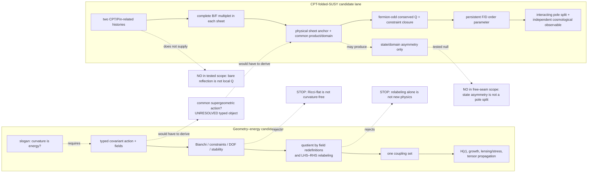

# ICE geometry–CPT–SUSY scientific-intuition map

Date: 2026-09-03

Status: **non-authoritative hypothesis-generation map**. This page organizes questions; it is not a
physics claim, evidence, an execution plan, or a fifth canonical ontology graph. Machine-readable
signals live in [`scientific-intuition-signals.v2.json`](./scientific-intuition-signals.v2.json); the
hash-pinned Gate-1 v1 snapshot remains unchanged. Their authority boundary is fixed by the
[scientific-intuition sidecar decision](../../docs/decisions/ICE_SCIENTIFIC_INTUITION_SIGNAL_LAYER_2026-09-02.md).

For a complementary reading route from one local continuum branch through boundary action, global
cycle, amplitude, physical state, and full-parent questions, see the
[abstraction connectivity map](./ICE_ABSTRACTION_CONNECTIVITY_MAP_2026-09-06.md). It does not identify
the geometry and CPT/SUSY lanes or add an evidence bridge between them.

## Answer first

The useful ICE intuition is not the sentence “curvature is energy” by itself. It is the more demanding
graph question:

> Can one declared action and one set of physical degrees of freedom produce a mechanism that survives
> equivalent descriptions and forces the same correlated effect in independent observable domains?

The geometry–energy idea and the temporal-folded-SUSY idea are therefore two separate candidate lanes.
They may meet only if a common action derives the bridge. Topical similarity, a shared word such as
“geometry”, or adjacency in a diagram is not that bridge.



Solid arrows above show a candidate dependency or handoff. They are canonical prerequisites only where
an exact `open:*` link says so. Dashed arrows are candidate or scoped rejection relations, not canonical
evidence edges.

## What the nodes mean

| Node class | Meaning here | Promotion rule |
| --- | --- | --- |
| `source-ref:*` | Primary-paper or standards comparator | Constrains a question; never supplies an ICE result |
| `intuition:*` | Source-linked candidate lens with a discriminator and stop condition | Stays outside the canonical graph |
| `concept:*` | Existing canonical vocabulary | Gives a stable meaning, not evidence |
| `claim:*` | Existing canonical scientific statement with declared epistemic state | Only canonical evidence may change it |
| `open:*` | Existing canonical missing object or test | Exact target of an intuition signal |
| `source:*` | Existing canonical literature record | Defines provenance and scope; does not establish an ICE result |
| `evidence:*` | Reproducible scoped calculation or analytic audit | May support only the claim and scope explicitly linked to it |
| `artifact:*` | Exact file/result locator and integrity record | Makes evidence inspectable; does not promote it |

The sidecar stores an exact `topic`, optional scope-matched `canonical_target`, and `source_refs`.
Read-only federation derives only these relations:

```text
intuition signal ─CITES_SOURCE→ source reference
intuition signal ─BELONGS_TO_SIDECAR_TOPIC→ sidecar topic
intuition signal ─TARGETS_CANONICAL_OPEN_PROBLEM→ canonical open problem (only when declared)
source reference ─MIRRORS_CANONICAL_SOURCE→ exact canonical source (when declared)
```

The v2 `topic_links` state that the two lanes are distinct while they may share an unresolved common
action. `DISTINGUISHES`, `REJECTS`, and `WOULD_PREDICT` in this page remain thinking aids. None of these
relations has been added to the canonical graph.

## Lane A — make “curvature is energy” calculable

### A1. First choose the object, not the slogan

The following statements are different and must not share one node:

1. `Λ g_mu_nu` may be written on the geometric or effective-stress side of Einstein's equation.
2. A modified action such as `f(R)` changes the equations and can introduce an effective extra mode.
3. All matter, including gauge and fermion data, emerges from a more fundamental geometric object.

Only the third is the strong ICE hypothesis. Neither the first bookkeeping identity nor the second
well-known model class proves it. A minimally usable candidate must type at least:

```text
action
  ├─ fundamental configuration object
  ├─ independent fields and gauge redundancies
  ├─ boundary terms and variational domain
  ├─ equations plus Bianchi/Noether identities
  ├─ physical degrees of freedom and sign of kinetic terms
  └─ matter/observer coupling that defines observables
```

The relevant machine lens is
`intuition:ice-geometric-action-versus-effective-fluid-relabeling`, under the sidecar-only
`intuition::topic:geometry-energy-unification`. It deliberately has no canonical target.

### A2. Quotient away descriptions that are not new physics

For a geometric correction `H_mu_nu`, the rearrangement

```text
G_mu_nu + H_mu_nu = 8 pi G T_mu_nu
G_mu_nu = 8 pi G (T_mu_nu - H_mu_nu / (8 pi G))
```

does not by itself change an observable. Likewise, two actions related by an admissible invertible field
redefinition may be different coordinates on the same physics. The graph must therefore compare
equivalence classes, not equation typography.

The stop rule is sharp: if the only difference is moving a term across `=`, renaming an effective fluid,
or changing variables without changing invariant observables, record `equivalent description`, not
`new phenomenon`.

### A3. Use vacuum Weyl curvature as an early counterexample

In the Schwarzschild exterior, `R_mu_nu = 0` and `R = 0`, while tidal curvature is nonzero. In geometric
units, one invariant is

```text
R_mu_nu_rho_sigma R^mu_nu_rho_sigma = 48 M^2 / r^6.
```

Therefore a literal `energy = R` or `energy = G_mu_nu` rule loses curvature that exists in vacuum. This
does not disprove every geometric ontology; it forces ICE to name a richer object and explain the
difference between matter energy, gravitational energy, tidal curvature, and conserved charges. The
machine lens is `intuition:ice-vacuum-weyl-and-degree-of-freedom-check`.

### A4. Pay the degree-of-freedom bill

Under Lovelock's stated assumptions, a four-dimensional local metric-only second-order field-equation
route is highly constrained. A candidate can leave that class, but it must say how: higher derivatives,
an extra field, connection/torsion, extra dimension, nonlocality, or another declared structure. Each
choice creates a concrete audit for constraints, propagating modes, ghosts, initial data, and coupling to
matter.

This turns a vague obstacle into a productive fork:

```text
same GR degrees of freedom
  └─ find a genuinely new global/boundary/topological observable

extra degrees of freedom
  └─ identify them, prove stability, and derive how they couple
```

### A5. Demand a cross-domain fingerprint

An expansion history alone can be represented by many effective dark-energy or modified-gravity models.
The stronger target is one fixed parameter set that correlates at least two independent consumers:

```text
background expansion H(z)
structure growth / clustering
lensing or gravitational slip / anisotropic stress
tensor propagation
```

If every consumer receives an independent free function, the graph has gained fit flexibility, not a
mechanism. The machine lens
`intuition:ice-geometric-sector-cross-domain-correlation` remains under the sidecar-only geometry topic.
It is not linked to the existing V=0 closed-FRW empirical bridge: that node has a narrower primordial,
reheating, non-flat-transfer, and likelihood scope and is not a generic modified-gravity target.

Primary comparators are [Carroll et al. on a curvature-corrected gravitational
action](https://arxiv.org/abs/astro-ph/0306438), [Lovelock's classification
result](https://doi.org/10.1063/1.1665613), [Bellini–Sawicki on correlated linear modified-gravity
observables](https://arxiv.org/abs/1404.3713), and the [Schwarzschild vacuum
solution](https://arxiv.org/abs/physics/9905030). They constrain the candidate space; none is ICE
evidence.

## Lane B — locate “SUSY on the other side” precisely

### B1. “Other side” is not currently a spatial location

The repository's tested object is a temporal/internal two-sheet construction: pre/post histories may be
related by CPT/Pin, while each sheet contains an ordinary boson/fermion multiplet. It is not a model in
which superpartners simply live at a distant point on the spatial universe.

Keep the transformations distinct:

```text
CPT/Pin: history or particle ↔ CPT-related history or antiparticle
SUSY Q:  bosonic state ↔ fermionic state
```

The [CPT-symmetric-universe](https://arxiv.org/abs/1803.08928) and
[two-sheeted-universe](https://arxiv.org/abs/2109.06204) papers are temporal-history comparators. The
[Wess–Zumino model](https://doi.org/10.1016/0370-2693(74)90578-4) supplies the local supersymmetry
comparator. None equates CPT sheet exchange with a supercharge.

### B2. What the repository has actually tested

The [Phase-17 algebra audit](../../cpt_temporal_folded_susy/PHASE17_TIME_LINE_FOLD_ALGEBRA.md) records:

- A standard support-local supercharge has zero cross blocks between the two open time halves.
- On a fundamental doubled internal sheet, the algebraic operator `Q^X = X_s tensor q` can exchange
  sheets and satisfy the fixed-positive-energy algebra.
- This algebraic opening still lacks a physical sheet anchor, common positive product and domain,
  conserved charge, Pin compatibility, and constraint closure.
- The tested bare time reflection is not a complex-linear fermion-odd supercharge; CPT/Pin remains a
  distinct, unconstructed sewing structure.

So the conservative live picture is:

```text
sheet minus ─CPT/Pin sewing?─ sheet plus
     │                           │
 ordinary SUSY Q             ordinary SUSY Q
     │                           │
 complete B/F multiplet      complete B/F multiplet
```

The stronger cross-sheet charge remains exactly the canonical
`open:gate4-spinorial-charge-domain-constraint-closure`. Its sidecar discriminator is
`intuition:ice-cpt-pin-sewing-versus-physical-cross-sheet-charge`.

### B3. A remote hidden sector cannot be both absent and protective

Within the ordinary visible-sector Ward-identity and loop-naturalness rationale, if the opposite sheet is
completely disconnected from visible fields, its partners do not enter our visible-sector identities or
loop cancellations. If it is coupled strongly enough to protect the visible Higgs sector, the theory
must expose that coupling through an action, propagator, physical charge, matching condition, or other
observable channel. “Unobservable but cancels our divergences” is not a completed mechanism. This is a
stop condition in `intuition:ice-persistent-breaking-to-cross-domain-observable`, not a general theorem
about every possible hidden sector.

This is the key interaction fork:

```text
no physical cross-sheet coupling
  └─ no visible-sector SUSY cancellation supplied

physical cross-sheet coupling
  ├─ specify locality/causality and gauge constraints
  ├─ compute its contribution to visible Ward identities and loops
  └─ accept correlated observables and experimental bounds
```

### B4. State asymmetry is not a mass spectrum

The [Phase-18 spectrum audit](../../cpt_temporal_folded_susy/PHASE18_GAUSSIAN_SEAM_SPECTRUM.md)
constructs a scoped free seam with a non-SUSY outgoing occupation pattern, but finds

```text
m_B,pole^2 = m_F,pole^2 = m^2
Delta m_pole^2 = 0.
```

The seam changes state/Keldysh information without moving the free retarded poles. A viable next object
must instead derive a persistent finite-energy, gauge-invariant `F`- or `D`-type order parameter, then a
renormalized interacting pole difference with matched seam-off, trivial-holonomy, dilution, regulator,
backreaction, and lifetime controls. The [Girardello–Grisaru soft-breaking
classification](https://doi.org/10.1016/0550-3213(82)90512-0) is a comparator, not a derived ICE
spectrum.

This remains `open:gate5-persistent-order-and-pole-splitting`, targeted by
`intuition:ice-persistent-breaking-to-cross-domain-observable`.

## The only honest bridge between the lanes

A compact candidate container is

```text
S_pair ?= S_SUGRA[Phi_plus] + S_SUGRA[Phi_minus] + S_seam[Phi_plus, Phi_minus].
```

The question mark is essential. This expression is not yet a theory because the repository has not
derived its field content, local supersymmetry, boundary terms, Pin lift, common physical domain,
constraint algebra, persistent order parameter, or empirical map. If “all matter is geometry” is kept as
the stronger ICE goal, a still deeper object would also have to derive `Phi_plus/minus` and their gauge
and fermion structure rather than insert them.

The bridge earns a canonical claim only if one construction closes this dependency chain:

```text
fundamental geometric/supergeometric object
  → covariant action and variational domain
  → physical fields, gauge symmetry, and positive state space
  → CPT/Pin sheet operation distinct from fermion-odd Q
  → anomaly-free common-domain constraint closure
  → persistent breaking carrier
  → interacting spectral consequence
  → second independent cosmological or gravitational consequence
  → same mechanism survives admissible choices and null comparators
```

At present every arrow in this proposed cross-lane bridge is open. Existing scoped calculations do not
constitute a new-physics discovery.

## Fast false-signal cuts

| Tempting inference | Required cut | Resulting status |
| --- | --- | --- |
| A term moved from geometry to stress energy is new physics | Compare invariant observables under equation rearrangement and field redefinition | Equivalent descriptions stay one node |
| `R = 0` means no curvature/energy content | Test a Ricci-flat, nonzero-tidal-curvature solution | Ricci-only identity is rejected |
| `f(R)` geometrizes all matter | Inventory its extra mode and matter fields | Modified gravity is a comparator, not full unification |
| Two CPT histories are superpartners | Type the CPT/Pin operator and fermion-odd `Q` separately | CPT sewing cannot substitute for SUSY |
| A sheet-mixing matrix proves physical exchange | Fix a basis-independent sheet observable and common domain | Basis artifact remains possible |
| A non-SUSY state proves mass splitting | Read renormalized interacting retarded poles | Free seam result stays null |
| A hidden sheet cancels visible UV terms without coupling | Exhibit its Ward identity/loop channel | Disconnected protection claim is rejected |
| One cosmological fit reveals a mechanism | Reuse the same couplings across independent consumers | Flexible single-domain fit stays inconclusive |

## Scientific-intuition loop

For any new idea, walk this loop before writing a runner:

1. **Object:** What exact field, operator, cycle, domain, measure, or observable is missing?
2. **Equivalence:** Could the effect disappear under a coordinate, basis, gauge, frame, or equation-side
   change?
3. **Counterexample:** What smallest exact solution kills the naive version?
4. **Mechanism:** Which one action and coupling set carries the effect through every arrow?
5. **Two consumers:** Does the same reason force consequences in at least two independent domains?
6. **Controls:** What matched null, sign/unit, domain, regulator, truncation, and solver checks separate the
   effect from an artifact?
7. **Choice robustness:** Which admissible choices were varied, and what invariant remained?

The central question is:

> **이 효과는 어떤 선택을 바꿔도 남으며, 다른 관측 영역에서도 같은 이유로 나타나는가?**

If either half is unanswered, retain an `intuition:*` question or `open:*` problem. Do not promote it to a
physics claim.

## Machine retrieval

Validate all sources and exact canonical bridges:

```bash
./ice intuition validate --json
```

Retrieve the geometry/empirical lenses:

```bash
./ice intuition search "Which invariant separates geometry from an effective fluid?" \
  --target intuition::topic:geometry-energy-unification --json
```

Retrieve the physical cross-sheet-charge lens:

```bash
./ice intuition search "Is CPT sewing distinct from a physical fermion-odd charge?" \
  --target cpt::open:gate4-spinorial-charge-domain-constraint-closure --json
```

Retrieve the persistent-spectrum lens:

```bash
./ice intuition search "What survives dilution and moves an interacting retarded pole?" \
  --target cpt::open:gate5-persistent-order-and-pole-splitting --json
```

For current canonical status, use the
[research graph atlas](../../docs/research/ICE_RESEARCH_GRAPH_ATLAS_2026-09-02.md) and
[current physics-discovery gap map](../../docs/research/ICE_CURRENT_PHYSICS_DISCOVERY_GAP_MAP_2026-08-31.md).
